Schon etwas länger her zum vorherigen Eintrag, aber ich kann mich noch sehr gut an dieses Segment erinnern. Die Ainu Kultur war einer der interessantesten Themen in Hokkaido, nebst den Daifukus, suizidalen Hirschen und alles andere, welches die Präfektur anbietete. Diese Ureinwohner lebten in der Natur und beteten ihre *Kamuy*s an. Dazu etwas mehr später.

Was gabs sonst noch? Eine tolle Passfahrt mit den guten alten japanischen Tunnels und ohrenbetäubenden Lastwagen. Aber auch treffe ich dank dem warmen Wetter immer mehr Veloreisenden, möge es Japaner oder Internationale sein!

Das Pausenziel dieses Segmentes war Hakodate, die südliche Hafenstadt von Hokkaido mit einer der (angeblich) schönsten Aussichten der Welt (Michelin gab einen Preis dafür).

## Die gefahrene Strecke

{{ leaflet() }}

- **Statistik**: $4921\text{m}$ Höhe à $490.46\text{km}$ auf 6 Tage verteilt (via gpx Datei ausgelesen)
- **Stimmung**: motivierter, da es gleich wieder einen Präfekurwechsel gibt. Aber auch werde ich Hokkaido vermissen, besonders Seicomart.
- **Tote Tiere**: total 25 tote Tiere auf der Strasse oder in der Nähe entdeckt (davon 3 Muscheln, 1 Seehund, 2 Seeigel und 3 asiatische Hornissen)

## Die Fahrt nach Hakodate

Vom Start in Obihiro ging die Tour westlich über den Nissho Pass nach Hidaka (besser gesagt ein Dörfchen vorher auf einen Campingplatz mit Onsen). Die Landschaft wurde dabei immer grüner, je tiefer und südlicher man fuhr. Nicht mehr waren nur die Nadelbäume grün, sondern auch langsam die gesamte Vegetation. Das macht Freude!









Vom Dörfchen gehts zur ersten Highlightstation, das *Nibutani Ainu Culture Museum*, welches ich kurz erkundete und die Atmosphäre genoss. Die Ainus arbeiteten meistens mit Ressourcen aus der Natur, daher war alles aus Holz, Gräser und Tierfelle. Aber auch tauchten diese in die Welt der Industrialisierung ein, insbesondere als Zwangsarbeiter oder Sklaven in Fischereien, als Japan Hokkaido kolonialisierte. Aber durch das Museum hindurchschlängleln war interessant und auf eine Art gemütlich. Wiederum dazu etwas mehr später!

Mit dem Museumsbesuch gemacht, ging es dann entlang der 'Innenküste' bis nach Hakodate. Dazwischen wurde campiert, die schöne Landschaft bestaunt, mit Reisenden, Japanern und Immigranten geredet und das zweite Ainu Museum besucht. Das *National Ainu Museum*, auch genannt *Opopoy* (Ainu-isch für Zusammenkommen), war um einiges grösser und ging in viele Themen ein, aber im Vergleich zum Kultur Museum ging es nicht so sehr ins Detail (aber immer noch genügend und empfehlenswert).





Auch cool war, die Landschaften von der Hinfahrt nach Wakkanai wieder zu sehen. Ich fuhr das letzte Segment (fast) gleich, wie am Anfang, als ich nach Hokkaido mit der Fähre kam. Alles war nicht mehr so kahl, sondern farbig und gemütlicher.









Ich hörs schon: "Warum isst du eine Pizza in Japan?!?!?". Einerseits, weil ich Lust auf Pizza hatte und anderseits es interessant ist, wie unterschiedlich international  beliebte Gerichte in den entsprechenden Ländern umgesetzt werden. Japaner kochen meistens mit ganz frischen Zutaten und daher kommen Gerichte wie Pizza oder Spaghetti Bolognese anders heraus, meistens sogar besser als zu Hause!

Zurück zur Route: was mich überraschte ist wie lange es dauerte von der Raststätte Nanairo-Nanae bis nach Hakodate. Ich fuhr durch Wohngebiete, die Vorstadt und schlussendlich Hakkodate selbst. Die Ruhe der Natur wurde dabei schon vermisst, da ich halt von der Fahrt sehr erschöpft war.





In Hakodate bei der Pension *Puppy Tail* angekommen, musste ich noch 20 Minuten warten, da ich zu früh ankam. Danach richtete ich mich im Zimmer ein und ruhte mich kurz aus, bevors zum Abendessen ging.

## Pass Nissho

Überraschenderweise hatte der Pass Nissho viel angenehmere Tunnels, da diese kürzer und auch heller waren im Vergleich zum Mikuni Pass. Der Pass verbindet Hidaka und Obishiro und wird auch entsprechend von Lastwagen als Transportstrasse gebraucht. Er ist hoch mit 1022 Höhenmeter, aber schön zum Durchfahren, auch wenn die Bäume noch nicht ganz grün sind.







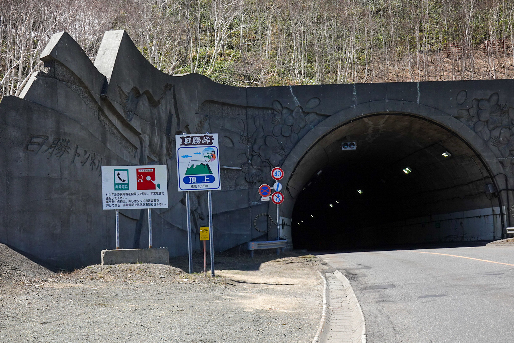



An diesem Pass lernte ich die Freundlichkeit der Motorradfahrer kennen. In der Schweiz begrüssen sich Motorradfahrer und Velofahrer gegenseitig eher weniger. Wahrscheinlich auf das beidseitige gefährliche Fahrverhalten (z.B. Kurvenschneiden und schnell fahren für die extra Instagram-Likes, oder das Nebeneinanderfahren der Velofahrer) und nicht grossen Respekt zu einander. In Japan scheint es umgekehrt zu sein. Auf Passfahrten winken und feierten die meisten Motorradfahrer die Velofahrer an, meistens mit einem *Ganbatte!* oder *Fighto!* (bedeutet "Gib dein Bestes!") und einer Faust in die Luft (eigentlich greift man noch mit der anderen Hand den Oberarm, aber ist halt schwierig auf dem Motorrad). Vielleicht passiert es mehr mit Tourenvelofahrern auf Pässen? Aber das ist cool und pflegt den Respekt der Velofahrer zu den Motorradfahrern! Wäre interessant dies in der Schweiz auszuprobieren!



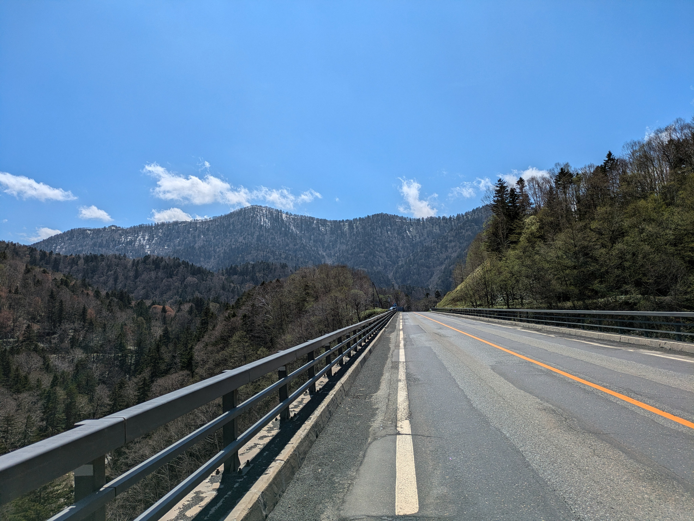



## Ureinwohner Hokkaidos: Ainu

Die Ainus waren mein Highlight dieser Strecke. Nun was sind die Ainus? Die sind die Ureinwohner Hokkaidos und auf den von Hokkaido nördlichen Inseln, welche heute zu Russland gehören. Sie sind ein Volk ohne Schrift und Wissen wird mündlich in Form von Geschichten, Lehre und Liedern an die nächste Generation weitergegeben. Auch wird viel von Hand gemacht.





Tägliche Kleider oder auch *Attus* genannt, sowie Utensilien und Fallen wie Armbrust-Fallen werden mit den Ressourcen in der Umgebung hergestellt, also Holz, Blätter, Tierfelle, Knochen und so weiter. Dabei wird sparsam mit den Ressourcen umgegangen: nur das nehmen, was nötig ist.

Die Attus haben einen interessanten Herstellungsprozess: 

- Ein passender Baum wird ausgewählt
- Die Rinde wird abgezogen und im Dorf gekocht
- Nach dem Trocknen der gekochten Rinde wird die innere, dünne Faser-Schicht abgezogen, wieder gekocht und getrocknet
- Mit dem *Fasern-Blatt* wird nun mit Messer oder Fingernagel Stück für Stück dünne Fasern abgetrennt und zu einen Faden gewickelt.
- Mit einem Web-Konstrukt, welches mit dem Körper gespannt werden kann, wird der Faden verwoben zu einem Stoff.
- Dieser Prozess dauert ungefähr zwei Monate inklusive Attus Näherei





Die Attus sehen nicht nur schön aus, sie sind auch Wasser-abweisend und grundlegend gegen Unwetter schützend.





Zwar hatten die Ainus auch Geschlechterteilungen, aber beide Geschlechter waren voneinander abhängig. Männer gingen auf die Jagd und waren für das Bauen von Fallen zuständig. Frauen hingegen kochten, nähten Kleider und arbeiteten in der Landwirtschaft. Das Belehren war auch getrennt: Buben lernten von ihren Vätern das Jagen und Ohrringe tragen und Mädchen lernten das Musterzeichnen, Nähen und Arzneimittel herstellen von ihren Müttern. Nicht zu vergessen ist, dass ich hier mich auch sehr kurz halte, da ansonsten der Text wieder extrem gross wird.









Die Ainu Kultur ist ein grosses Thema in Hokkaido. Es fühlt sich so an, als hätten die Japaner gemerkt, dass sie eine riesige Kultur fast ausgelöscht hätten und bieten nun die Möglichkeit an, diese Kultur wieder aufleben zu lassen. Workshops, Museen, Cafés geführt von Ainus werden regelmässig angeboten für Einheimische und Touristen. Ich find das cool und hoffe, dass es auch erfolgreich wird.

Die Ainus beten ihre *Kamuys*. Diese sind Götter und Kräfte 'wohnhaft' in vielen verschiedenen Lebewesen, Objekte und Werkzeugen. Es gibt ein Berg-Kamuy, sowie ein Ernte-Kamuy und viele weitere. Tiere sind die Götter verkleidet im entsprechenden Tierfell. Die Ainus unterhalten sich einseitig mit diesen Göttern durch Rituale und Fester. Es wird entweder bedankt für die gute Ernte oder geklagt, weil es seit zehn Tagen nicht aufhörte zu regnen. Entweder hören die Götter zu oder nicht. 





Was man natürlich nicht vergessen darf ist, dass auch diese Kultur ihre Schattenseiten haben. Das hat ja dumm gesagt jede Kultur. Ein Beispiel wäre das Bären-Opfer: Verwaiste Bärenjunge wurden für ungefähr zwei Jahre in einem Holz-Käfig grossgezogen und danach umgebracht, damit es zu den Eltern-Bären in der Seelenwelt wieder zusammen kommen kann.

Es gibt noch so vieles über die Ainus, welches ich erzählen könnte, aber das wird wahrscheinlich am Fotoabend erläutert.

## Hakodate

Hakodate ist nicht gross, wenn man z.B. Sapporo vergleicht, sondern sehr weitläufig. Es gibt drei Touristen Gebiete: ein Restaurant Viertel, ein Sightseeing Viertel und ein Shopping Viertel. Diese sind mit zwei Tram-Linien verbunden, welche doch sehr regelmässig umherfahren. Die Stadt ist gemütlich und auch auf eine Art ruhig. Ich verbrachte zwei Tage dort, bevor es dann mit der Fähre nach Aomori ging.





Nun, ehrlich gesagt hatte ich nicht so viel Sightseeing gemacht. Ich ging eine kleine
Wanderung auf den 'Gipfel' Hakodate machen und besuchte Kikonai mit dem Zug, um den letzten (aber nicht aller letzten) Stempel der Raststätte-Stempelstafette zu holen. Mittags und Abends ging es in ein Restaurant für einen Gaumenschmaus.







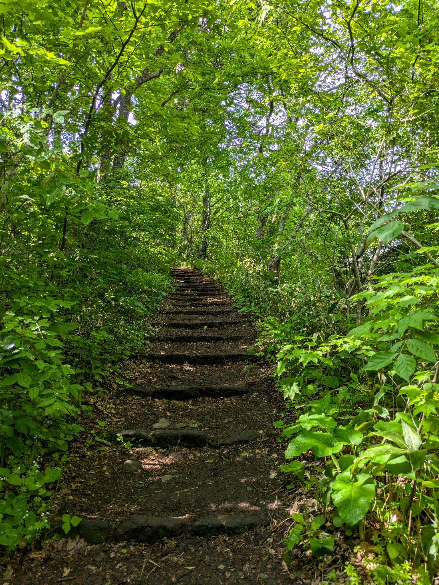







Die Pension, wo ich übernachtete war gerade in der Nähe Des Restaurant Viertels und neben dem Bahnhofs. Somit war es einfach, am Abend oder Mittag etwas zu finden und einen Ausflug nach Kikonai zumachen. Apropos Kikonai, das ist ein kleines Küstenstädtchen, wo das grösste Gebäude die Shinkansen-Station ist. Das Städtchen selber hatte eher wenig zu bieten, dafür was es gemütlich und ruhig.



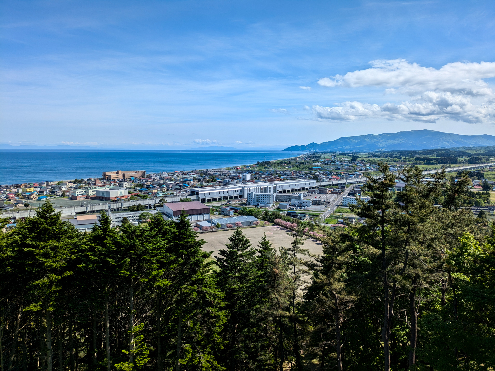







Nun, wie kommt man eigentlich nach Kikonai? Ja über den Bahnhof! Als ich dort ein Ticket kaufen wollte, hat man mir das Tages-Ticket vom 7-11 Minimarkt empfohlen und ich möchte den Verantwortlichen für den Ablauf, um so einen Tages-Ticket zu kaufen, umbringen.

1. Man geht in den 7-11 im Bahnhof zum Drucker. Alles ist auf Japanisch, kein Englisch!
2. Links hat es eine Anleitung, um einen Beleg zu drucken (also noch nicht das Ticket). Ebenfalls in alles in Japanisch.
3. Mit dem Beleg geht man an die Kasse und erhält dann das Ticket
4. Um nun nach Kikonai zu gehen muss man noch ein Ticket kaufen zur nächsten Station, da das Tages-Ticket eher eine Tages-Vergünstigung ist (man spart schon den halben Preis).



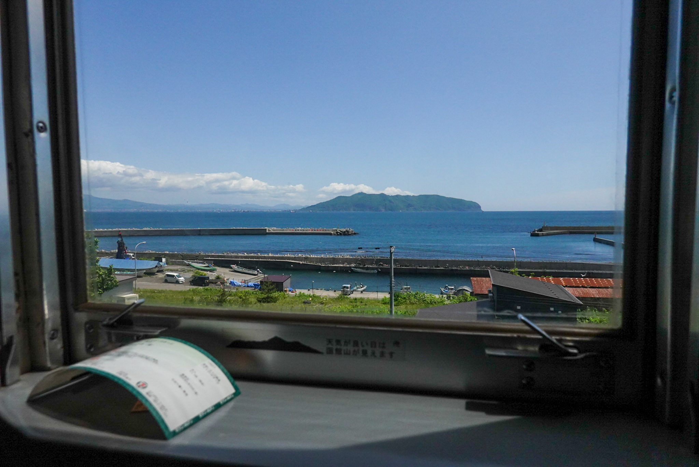



Am letzten Abend in Hakodate ging ich mit Max dem Italiener in ein Butadon-Pub/Café/Bar/Wieauchimmer. Butadon ist Obishiro Ding, aber der Besitzer des *Butadon Porco* kam aus Obihiro und baute sich sein Platz in Hakodate auf. Es war extrem gemütlich eingerichtet und das Essen war sehr lecker: Schweinefleisch mit Knoblauch-Butter auf Reis gelegt.





Fun Fact: *Buta* heisst Schweinefleisch, *Don* heisst "auf Reis gelegt". Man kann das Buta durch andere Begriffe ersetzen, um den Aufsatz aufs Reis zu ändern!





## Was sind *gute* Ferien? 

Während dem Fahren kamen mir ab und zu die eine Frage in den Kopf: Muss man **die** Sehenswürdigkeiten besuchen, damit sich die Ferien gerechtfertigen?

Man sollte schon die Zeit ausnutzen, die man hat, aber ich denke es macht nicht wirklich Sinn, gewissen Attraktionen nachzurennen, nur weil es auf Social Media oder im neusten Aldi-Magazin empfohlen wurde. Das ist ja unter anderem bekannt als *FOMO* (fear of missing out, also das Verpassen von Dingen), welches die heutige Jugend extrem plagt und psyichisch nicht das Gesündeste ist, da es eine Art ungesunden Stress auslöst.



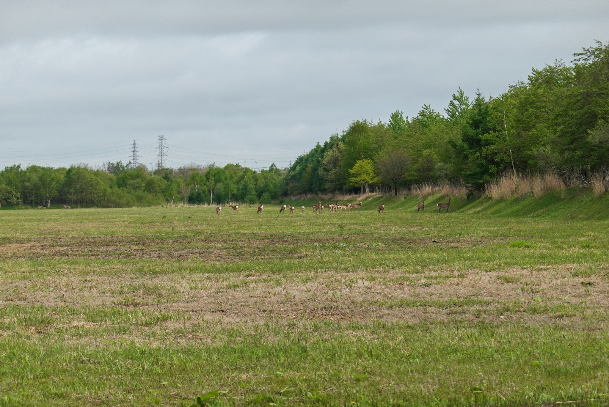



Diese Velotour baut, wie bereits ein paar Mal vorher erwähnt, auf Flexibilität auf, also dass jeden Tag geschaut wird, wohin ich fahre und baue ab & zu Vorschlägen von Lokalen und Reisenden ein (z.B. Wakkanai oder die Backstube Hanamaki, die im nächsten Eintrag vorkommt). Da ich mich sehr wenig mit Recherche befasst habe, verpasste ich eigentlich das *Wichtigste*, also **die** Gelateria, **das** Museum oder **die eine** Statue von Hochika. Aber **muss** man es sehen? Nein, denn es wird ja nicht das letzte Mal sein, dass ich Japan besuchen werde. Auch weil ich unterwegs bereits vieles gemacht und gesehen habe, wie zufällige Gelaterias und die Ainu Museen besucht. Das Land ist schön und hat wirklich viel zu bieten, wenn man sich auf deren *Quirks* einlässt.

Ich werde nicht die ganze Welt sehen können, da hab ich schlicht zu wenig Geld & Zeit und einfach auch nicht das Bedürfnis. Auch möchte ich Velotouren in Zukunft noch machen, weil es mir erlaubt, kleinere Gebiete länger zu geniessen. Ich kann regelrecht kein *Speed-Tourism* machen, weil ich auf meine körperliche Fähigkeit limitiert bin, um das Velo zu fahren. Ich find das gut!

## Weitere Highlights





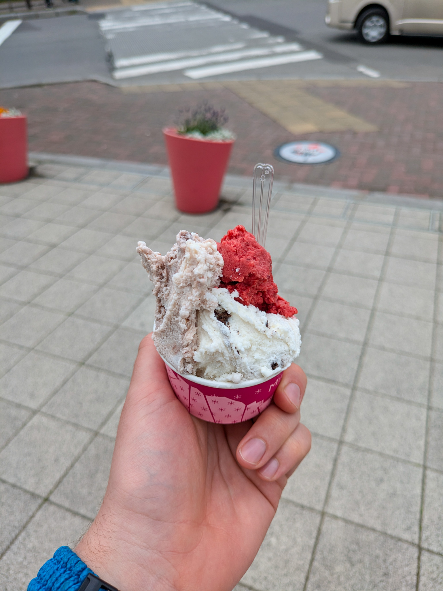

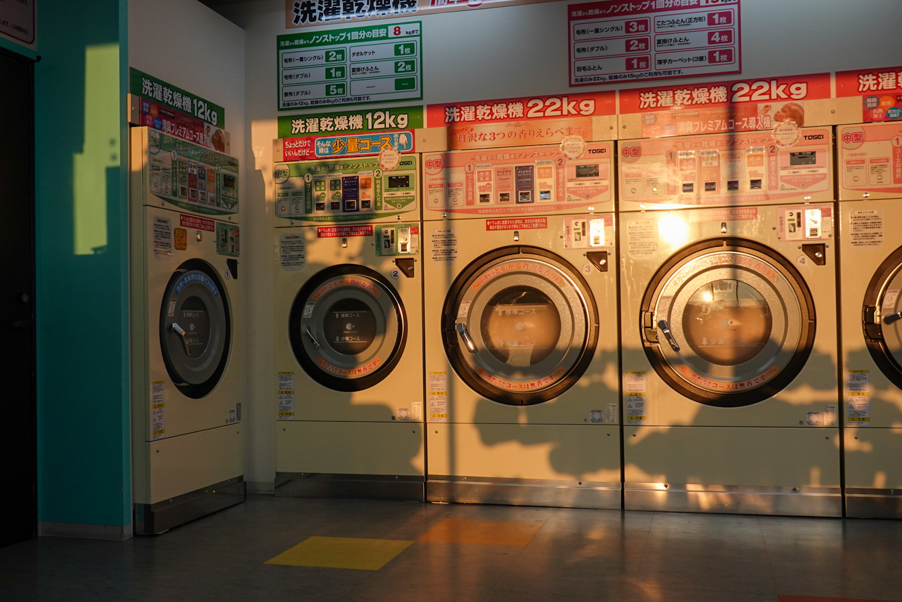











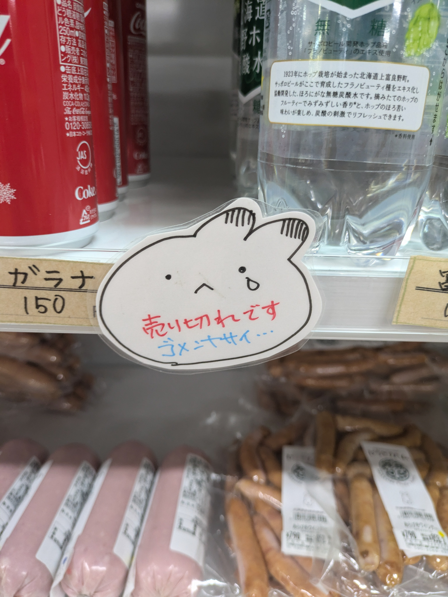



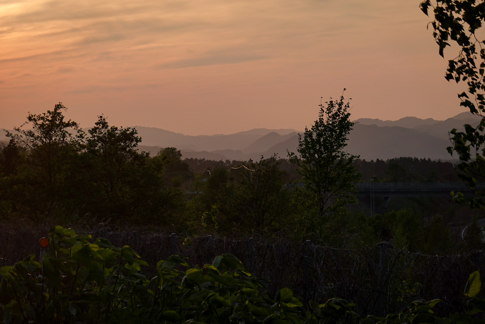







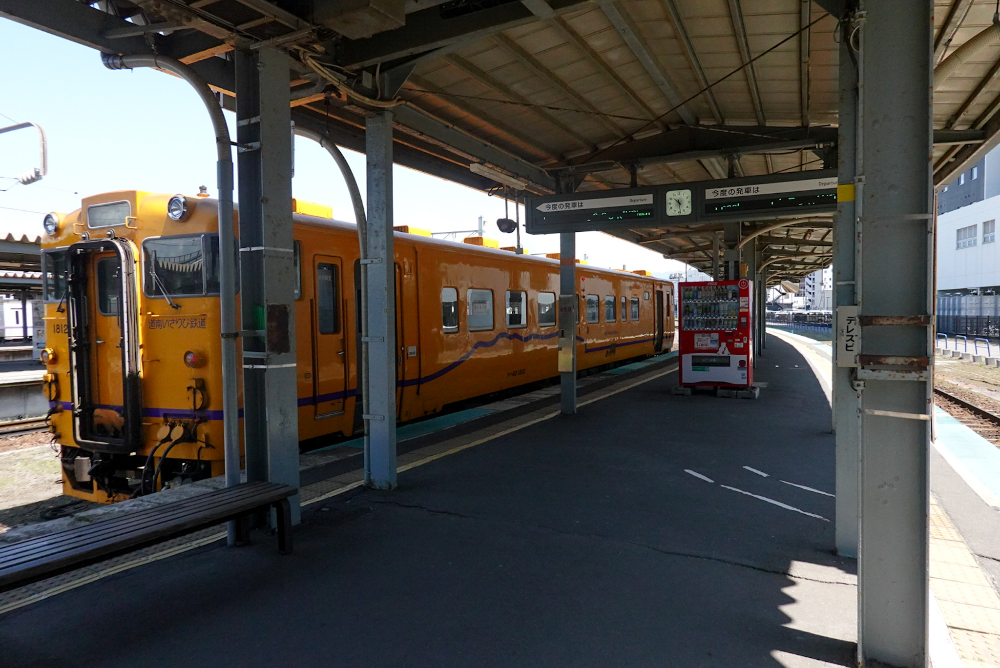



---

Einige Zeit her, seit dem letzten Bericht, aber ich bin glücklich, diesen Bericht fertig geschrieben zu haben! Die Berichte brauchen Zeit, mehrheitlich um das Geschriebene zu verdauen und wenn nötig anzupassen.