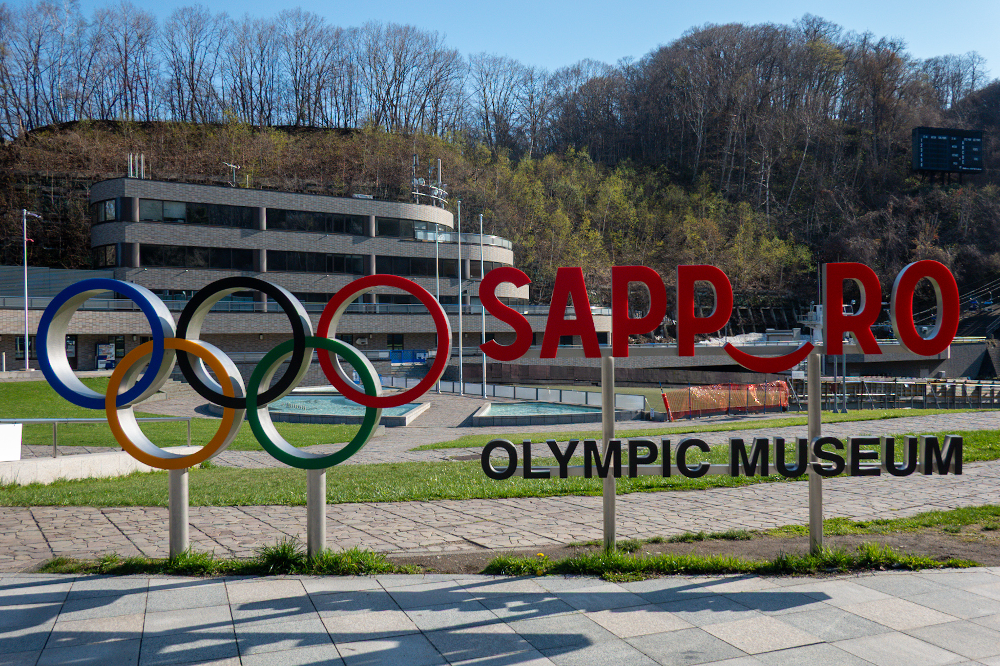

Puh, die Beine schmerzen schon noch sehr als ich in Sapporo ankam. Diese Etappe beinhaltet bis jetzt die meisten Fahrtage zwischen den Pausen. Ganze 9 Tage und das ist schon eher auf meiner oberen Grenze. Als Regel habe ich mir gesetzt, alle 5-10 Tagen mindestens ein Pausetag einzurichten. Damit sollte meine Freude am Velofahren noch existieren! Auch ist es ein Art Zwang, dass doch noch Sightseeing gemacht wird.

Was gibt's sonst was... Ah ja, ich hatte ja noch Geburtstag (gestern). Den habe ich zum Teil in einem Internet-Café verbracht (<a class="internal" href="#photos-backup-station">Bilder</a>), da ich irgendwie die Bilder auf der Kamera effizient auf die Cloud übertragen musste. Nach etwa 3 Stunden konnte ich mit Erfolg alle Bilder hochladen und habe mich entschieden, ein bisschen weniger Bilder zu machen, damit der Speicherplatz noch reicht.

Auch anzumerken ist die *Golden Week*, welche letztes Wochenende begonnen hatte und dieses Wochenende fertig ist. Plötzlich lebten die Campingplätze auf von Japanern mit ihren beneidenswerten Camping-Setups. Die Plätze sahen so gemütlich aus und die Zelte waren etwa 4-5 mal grösser als meins. Tja, kommt halt davon, wenn man mit dem Velo reisen möchte...

## Die gefahrene Strecke

{{ leaflet() }}

- **Statistik**: $6861\text{m}$ Höhe à $643.95\text{km}$ auf 9 Tage verteilt
- **Stimmung**: besser, da ich die Kilometer besser aufteilen konnte und noch interessantes erleben konnte
- **Tote Tiere**: 15 tote Tiere auf der Strasse entdeckt (davon 3 Muscheln)

## Hokkaido(rt hingehen)

Okay, extrem schlechter Wortwitz...

Nach zwei Pausentagen in Aomori City ging es nun Richtung Hokkaido, wo mein erster grosser Meilenstein der Reise ist. Ebenfalls habe ich dort einen oberwichtigen Termin, mehr dazu aber etwas später.





Zuerst einmal war das Ziel _Oma_, den nördlichsten Punkt von _Honshu_ (die "Hauptinsel" Japans). Das Velo wurde gepackt und die Fahrt ging los! An meinem Abreisetag war ebenfalls der _Sakura Marathon_ in der Stadt und ich fuhr ein Segment des Marathons hindurch. Es war einiges los mit den Helfergruppen, welche das Gelände absperrten und Trinkstände aufbauten, und Polizisten, welche den Verkehr regelten.

Sobald ich aus der Stadt war, ging es der Küste entlang mit dem Ziel zwischen Mutsu und Aomori ungefähr in der Mitte der Route zu campieren. Nach Plan käme ich zu einem Campingplatz an der Küste, aber so wie Pläne halt sind, verlief er nicht wie gewollt. Der Wind war das Problem. Frühling scheint die Küsten windig zu machen wegen den Temperaturänderungen. Ich entschied mich Inland zu gehen, um dem Wind möglichst zu entkommen. Auf der Suche nach einem Platz fragte ich einen Spaziergänger nach einem *inoffiziellen* Campingplatz. Er wies mich zu einem Park hin, welcher mit einer Toilette ausgestattet war und fliessend Wasser hatte. Das Problem war gelöst.





Meine im Verlaufe dieser Ereignissen wechselnden Stimmung fing mit Anschiss an, wechselte zu Stress und endete mit Erleichterung. Ich weiss eigentlich, dass ich am Ende des Tages ein Schlafplatz finde werde, aber wo dieser sein wird bringt mir Stress.

Nun zurück zur Reise. Weiter ging es zur Stadt Mutsu, wo ich in der Nähe auf einem Camping übernachtete. Direkt neben dem Camping gab es eine Onsen und die war extrem heiss! Das Badwasser war ca. 50°C und neben dem lebendig gekocht werden konnte man auch in ein Eisbad baden gehen. Aber das Onsen half, beim Schlafen Wärme zu geben, da man den Körper extrem aufwärmt (und angeblich helfen die Mineralien der Bäder, die Wärme zu halten).









Die Reise ging weiter bis nach Oma. Dort wollte ich wiederum campieren, aber der gottverdammte Wind hatte ein Problem mit mir. Oder war es Petrus? Egal, ich schlief als Alternative in einem Hotel, welches auch eine Onsen hatte. Am Tag danach ging es mit der Fähre nach Hokkaido!

## Im Bauern-Restaurant vom Töpfer

> Ausser Reisen erlebt man keine Freiheit.

Dieser Spruch, zwar mit einer Übersetzer-App übersetzt, kam aus dem Mund eines 72 jährigen Restaurant Besitzer und Koch mit 45 Jahre Töpfer Erfahrung. Das war am dritten Tag der Etappe im Bauer-Restaurant Mokuba, welches nach Mutsu Richtung Oma aufzufinden ist. Das ganze Restaurant war ein skurriles Abenteuer, da nebst dem geilen Menü (1500 Yen für ein fünfgänger Menü) auch das gesamte Geschirr von ihm gemacht wurde. Jede Tasse und Teller sahen anders aus! 









*Für ihn sei es Zeit, wieder zurückzugeben anstatt nur zu nehmen*, teilte er mir mit und rein die (etwas stockende) Konversation war einer der interessantesten Ereignisse auf der Tour. Ich hoffe er lebt noch viele Jahre und wünsche ihm grossen Erfolg bei seinem Wunsch.





## Soon in your (Japanese) TV Schedule

Was ich noch nicht so erwähnt habe ist, dass ich zu Beginn der Reise, im Internationalen Flughafen Narita, von einem Interview-Team kurz aufgegabelt wurde. Sie sind vom *TokyoTV* und befragen Reisende, warum sie nach Japan kommen!

Naja, irgendwie war es klar, dass genau ich aufgegabelt werde: ich mit dem Gepäck-Wagen wo quer ein riesiges Velo-Paket drauflag und noch dazu die Gepäcksschachtel. Aber ich glaube, was das Team gepackt hatte ist, dass ich von der *Hokkaido Stamp Rally* schwärmte! Schwärmen war eher ein bisschen übertrieben, ich fand die Idee, ein Teil einer Raststätten-Stempelstafette mit dem Velo zu machen, einfach witzig. Folgend wurden Kontaktdaten ausgetauscht und ein Reminder, dass man sich dann in Hokkaido trifft.

Nun ist die Zeit gekommen! Um 06:50 Uhr sass ich auf der Fähre in Oma und das Fahrrad war an einer Mickey Mouse-Decke an ein paar Rohren bei der Parkfläche festgebunden. Es regnete Hunde und Katzen. Die Fahrt war sehr gemütlich und als *Standard* Ticket (3.Klasse) konnte man auf eine Teppichfläche sich gemütlich ausbreiten.





Schritt für Schritt kam der Südteil von  Hokkaido immer näher, bis ich ihn Hakodate ankam. Direkt am Ausgang wurde ich vom TV-Team begrüsst: Yuji der Direktor, Miwa die Dolmetscherin, ein Kameramann von Sapporo (sicherlich hiess er nicht Bruno) und *Audio-Guy* (er hatte sich am letzten Tag so verabschiedet). Sie interviewten mich und rüsteten mich mit einem Mikrofon aus und montierten eine GoPro an meinem Velo. 









So wurde ich für die nächsten fünf Tagen begleitet. Man fuhr mir hinten nach und filmte mich. Man fuhr mir davon, um mich dann zu filmen. Man filmte mich beim Essen. Man filmte ich, wenn ich Snacks irgendwo im Seich am essen war. Man filmte mich, wie ich mein Zelt aufbaute. Und man filmte mich bei Interviews.





Wie können das bekannte Schauspieler und Weissichwas durchhalten? Auf eine Art war es sehr interessant und auch hilfreich, da Miwa beim Übersetzen sehr geholfen hatte. Aber durch die Erschöpfung vom Velofahren, machten mich die Interview-Fragen innerlich reizend. "*Why did you eat your Onigiri here, where it's not so beautiful*" wurde ich gefragt und der metaphorische Schirm ging mir zu. *Was ist das für eine Frage?!?!* schoss mir durch meinen erschöpften Kopf und ich antwortete ungefähr mit "*because I was feeling a bit hungry and didn't wann to hit a hunger-wall or get bonked*", also das ich keinen Hungerrast haben wollte.





Diese Gedankenblitze waren für mich meistens noch anstrengender als die Fragen selbst in diesen Momenten, denn ich wusste, dass ich mich zusammenreissen muss und das Team nichts dafür kann. Ich habe das Team sehr geschätzt, aber meistens wollte ein bisschen mehr *Ich*-Zeit, besonders am Abend. Aber die Begleitung war auch nur fünf Tage mit mir unterwegs und somit reiste ich mit ihnen umher. Aber wo war das *umher*?





Die Raststätten! Ich fuhr von Raststätte zu Raststätte, kaufte etwas ein oder ass die dortige Spezialität (wenn es eine gab) und wurde währenddessen vom TV-Team gefilmt.









Verabschiedet haben wir uns auf der Raststätte auf dem Nakayama Pass, wo es frittierte Kartoffeln gab, die, für das sie nur Kartoffeln in einem Teig waren und frittiert wurden, sehr geil waren! Falls du mal Lust auf drei frittierte Kartoffeln am Stiel hast, kauf dir ein Flugticket und geh schnell zur Raststätte "Bōyō-Nakayama" und hol dir für nur 3 Franken (aktueller Yen Franken Kurs) dieses Ding!





Die Bye-Bye Szene wurde gedreht, die Royce Snacks wurden eingekauft und das Team begleitete mich noch zum Campingplatz, bevor ich dann wieder alleine war. Lustigerweise in einem Bärengebiet auf einem Campingplatz wurde ich alleine gelassen, aber dafür hatte es eine Onsen in der Nähe!





Im Nachhinein war es ein tolles Erlebnis und bin sehr dankbar dafür. Würde ich es nochmals machen? Natürlich und besonders nachdem ich meine Lektionen gelernt habe beim ersten Mal.

Und ein nützlicher Frage-Satz habe ich auch noch gelernt:

> Osusume no **michi no eki** doko desu ka (おすすめ の **みちのえき** どこ です か)

Damit kann ich die lokalen Japanern nach empfehlenswerten Raststätten fragen. Aber nicht nur das, denn man kann das *michi no eki* einfach durch andere Wörter ersetzen (z.B. um nach guten Restaurants, Museen oder Bars zu fragen).
## Wo sind die Mülleimer?

Senderwechsel! Als Reisender ist das Entsorgen von Müll eine schmerzhafte Angelegenheit. Jede leere Ecke in meinen Taschen ist gefüllt mit leeren Verpackungen von Gummibärchen, Onigiri oder anderem Zeug. Und ich werd das Zeug nicht (so einfach) los.

Warum ist das aber so?

In Japan ist das Entsorgen des Mülls nicht etwa die Verantwortung der Regierung oder lokale Gemeinde, sondern bei **dir**, dem Bewohner/Konsument. Das bedeutet, dass es nicht viele öffentliche Mülleimer oder Recyclingstationen gibt. Nun, als Reisender, welcher ja kein festen Wohnsitz hat, ist man ein bisschen im _Seich_. Aber meistens nehmen Campingplätze oder die Minimärkte den Müll ab, wenn man lieb fragt!





Ein Nebeneffekt von diesem System ist, dass der Müll "alternativ" entsorgt wird, nämlich einfach aus dem Fenster werfen während dem Fahren auf Nationalstrassen. Daher ist es ein bisschen schräg, dass Japan als sauberes Land gilt, wenn dies für Städte und Dörfer gilt, während die Strassen mühsam von Freiwilligen aufgeräumt werden muss. Es sind nicht nur leere Dosen oder die Plastikverpackung des Mittagessens, sondern auch Mikrowellen, Kleider, alte Röhrenfernseher und Zigaretten aufzufinden.





Bevor man den Sennenhut aufsetzt und sagt: "die haben uns ja komplett verarscht diese (unpassendes Wort, welches die Augen der Japaner beschreibt)", darf man nicht vergessen das es auch Orte in der Schweiz gibt, die so dreckig sind, und hier meiner Meinung nach die Regierung ein bisschen versagt hat. Wie kann man Müll entsorgen vereinfachen? Indem das Entsorgen leichter oder lohnenswerter gemacht wird, als das Wegwerfen! 

## Internationale Austausch

An meinem Pausentagen in Sapporo lernte ich ganz kurz Aman kennen, ein Inder von New Dehli, welcher in Tokyo an seinem Startup arbeitet. Danach, nach einer Nissage durch die Stadt traf ich Aman wieder (ich erkannte seinen orange Rucksack wieder)! Wir unterhielten uns und machten uns auf dem Weg zu einem Soup Curry Restaurant. Denn Sapporo ist bekannt für dieses Gericht. Und ja, es ist dumm gesagt eine Currysuppe, einfach geiler!

Beim ersten Restaurant war alles voll und wir gingen zum nächsten Restaurant.  Dabei trafen wir zwei Singapurianer (schreibt man das so?), Joseph und Phoebe, und endeten schlussendlich zu viert im *Soup Curry Treasure*. Und das Curry war jetzt nicht weltbewegend, aber doch noch gut! Der Austausch untereinander war auch noch lustig und man lernte einander ein bisschen kennen.





## Mini Velo Service in Sapporo

Ein Ziel in Sapporo war der Veloshop *Sam's Bike*, welcher von der Webseite HokkaidoWilds empfohlen wurde. Der Shop bietet nebst vielen Velokomponenten, Kleider und Taschen auch extrem begeisterte Mitarbeiter an. Als ich mit meinem Velo ankam, war die Frau (ich habe leider den Namen vergessen, werde evtl. nachfragen) im Laden begeistert. Leider konnte sie kein Englisch (beide im Laden konnten kein Englisch), aber mit der Übersetzer App konnten wir uns austauschen!





Am Velo gab es Probleme mit dem Gangschalten und der Hinterrad-Reifen musste gewechselt werden wegen einem Loch. Während das Velo geputzt wurde, konnte ich einen Inhouse-Kaffee ausprobieren und kaufte mir noch zwei Packgürtel für den Gepäckträger und eine Snacktasche!





Das Faszinierende am Shop sind nicht Nur die faszinierende Besitzer des Ladens,  sondern auch die Einrichtung. Der Laden ist gefüllt mit Velos, Kleider, Taschen und anderem Krimskrams. Es hat fast keinen Platz und doch ist es gemütlich drin zu sein!













## Wie gehts der Einsamkeit?

Im vorherigen Bericht habe ich mich ein bisschen mit meiner Gefühlslage befasst. Hat sich seitdem etwas geändert? Ungefähr.

Ich habe das Gefühl, dass es besser geht mit dem Alleinsein als vorher. Natürlich nicht "perfekt", da es nicht umsonst einen instinktiv psychologischer Schmerz gibt, wenn man sich von den eigenen sozialen Kontakten (un-)freiwilling distanziert. Den wird man nicht los und ist auch gut so!

Dieses Alleinsein hilft mir auf eine Art herauszufinden, wie wenig an sozialen Interaktionen ich noch verkraften kann bevor es dann Richtung Depression gehen könnte. Ob dies der definitive "Wert" ist, glaube ich nicht, aber es gibt mir eine gute Schätzung, um daraus eine "No-Go" Zone anzunehmen!

Ich habe angefangen, Smalltalks oder kleine Interaktionen mit den lokalen Japanern sehr wertzuschätzen. Mein Favorit bis jetzt ist immer noch mit Tomoko und Horikawa vom Futabaya Inn ([Eintrag Link](/projects/japan-2025/kulturschock-japan/#nebst-meer-und-lastwagen-noch-ein-kraftwerk))! Aber auch möchte ich den vorher erwähneten Fragesatz mehr ausprobieren und ein bisschen Gespräche freestylen (mit meinem brüchigen Japanisch).

Es blüht langsam auf und ich gewöhne mich immer ein bisschen mehr an Japan, aber auch freue ich mich immer noch über die Schweizer Gespräche!

Was ich aber auch noch gut finde ist, dass man einfach zuhören kann. Aktuell sitze ich im Pausenraum einer Onsen. Es ist leer und das Einzige, das ich höre, sind der Kassierer, wie er Münzen zusammensammelt, und das Rauschen der Getränke-Automaten. Man fängt an die Geräusche rund um sich herum anzuhören. Plus die "Autonomie", die ich als Tourist ausleben kann, hilft extrem, sich in solchen Situationen irgendwie wohl zu fühlen. Ich geniesse solche Momente während meiner Reise sehr! Morgen bin ich dann weg von diesem Ort und das Onsen Team vergisst mich nach ein paar Minuten wieder.

Ich würde wiederum gerne mehr meine Gedanken preisgeben, aber auch jetzt bin ich müde und gehe in den Schlafsack. Auf ein andermal!

## Weitere Highlights

Hier entlang für mehr Highlights!













































Als ich ins Hostel Yasube kam und am nächsten Tag an den Morgentisch kam, sah ich eine Reihe von Mangas. Mehrheitlich dieser Bücher war eine Serie: *Space Brothers*. Ich bin schon ein langer Fan dieser Serie, denn es erzählt eine interessante Geschichte von zwei (fiktiven) Brüdern, die zusammen ins Weltall gehen möchten. Falls das Bedürfnis da ist eine wirklich tolle Geschichte zu lesen, kann ich diese Serie empfehlen! Leider gibt es noch keine Deutschauflagen oder in Buchform, daher muss man vielleicht den Piratenhut aufsetzen...

---

Es gab noch so viel mehr, dass ich zeigen könnte, aber ich brauch ja noch was für den Fotoabend ;)

Gute Nacht und bis dann!b