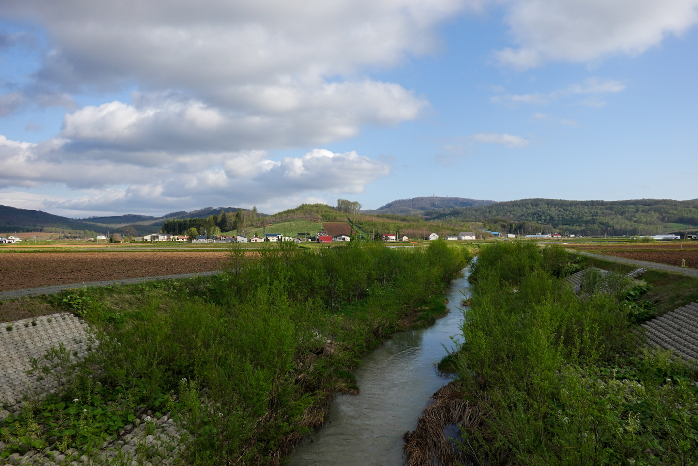
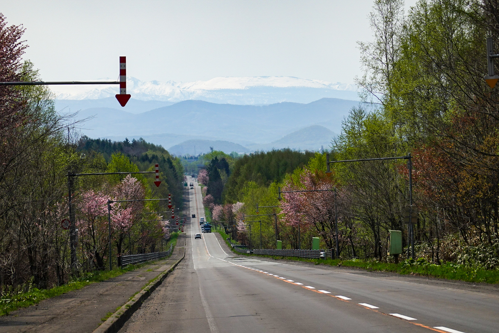
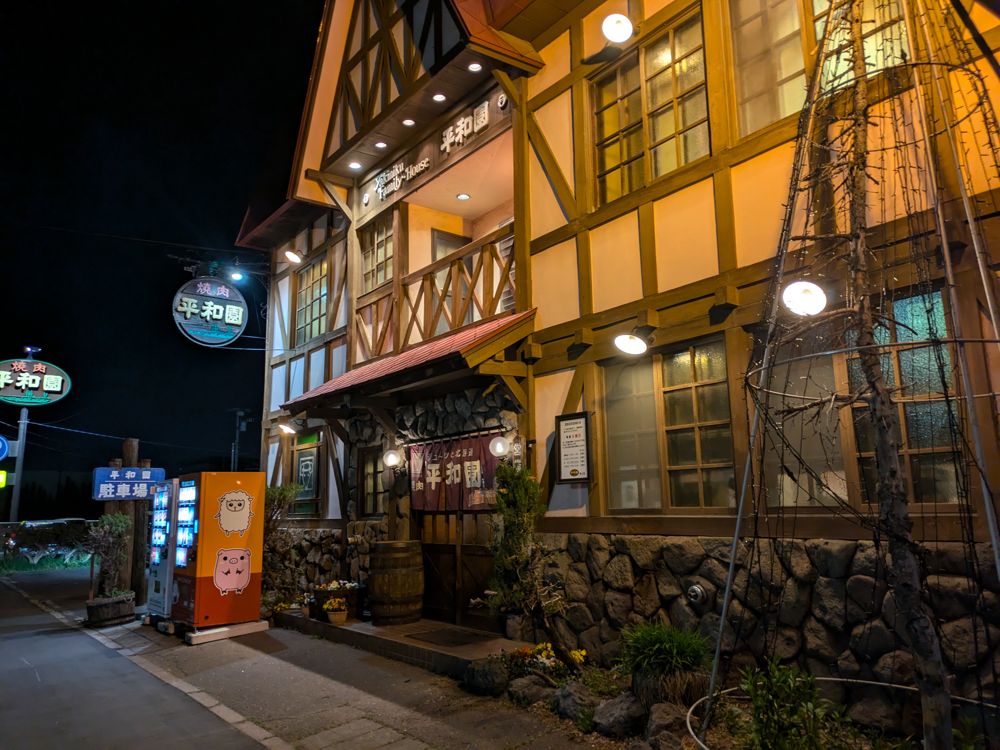
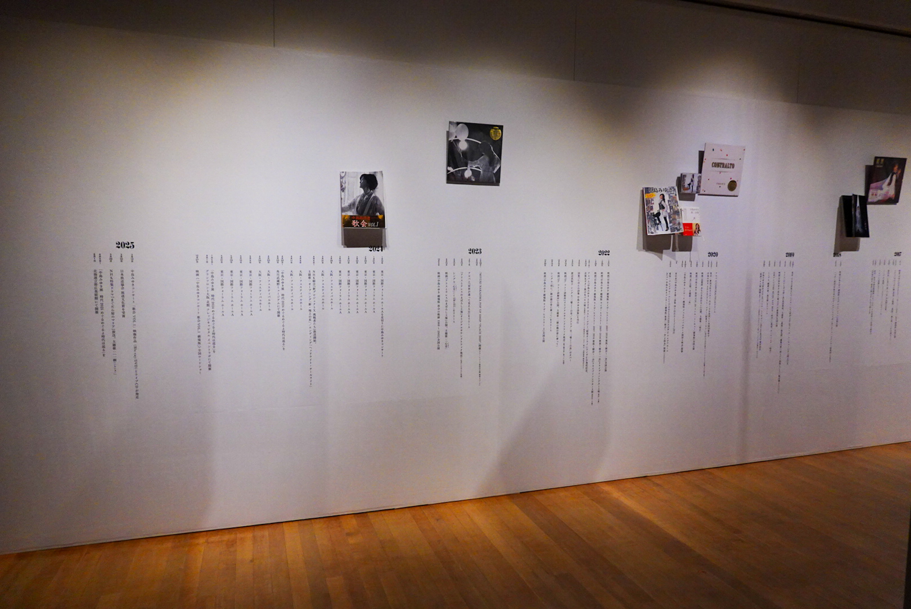
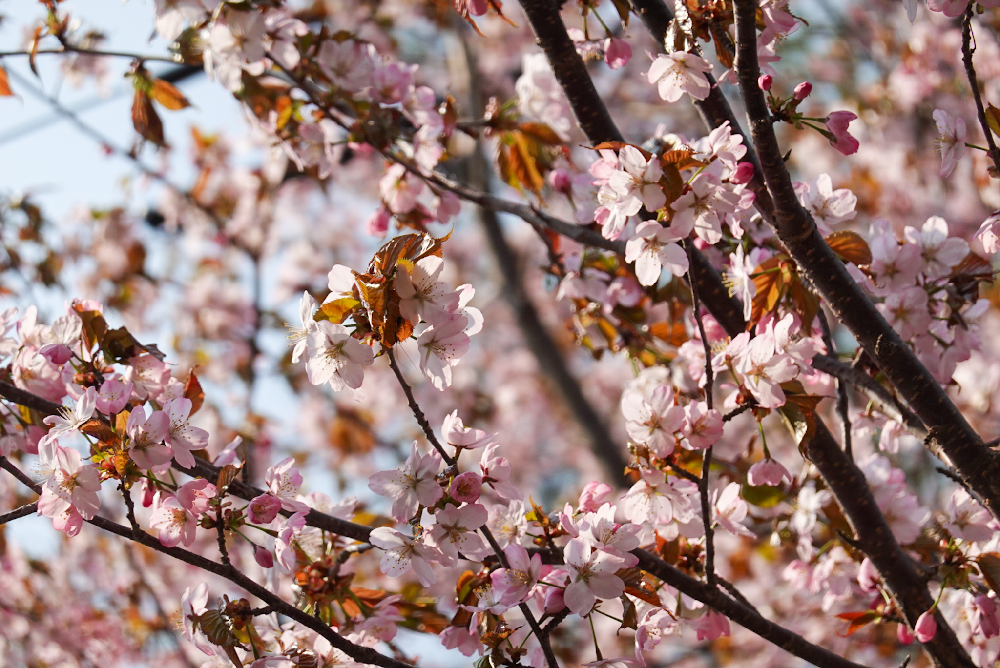
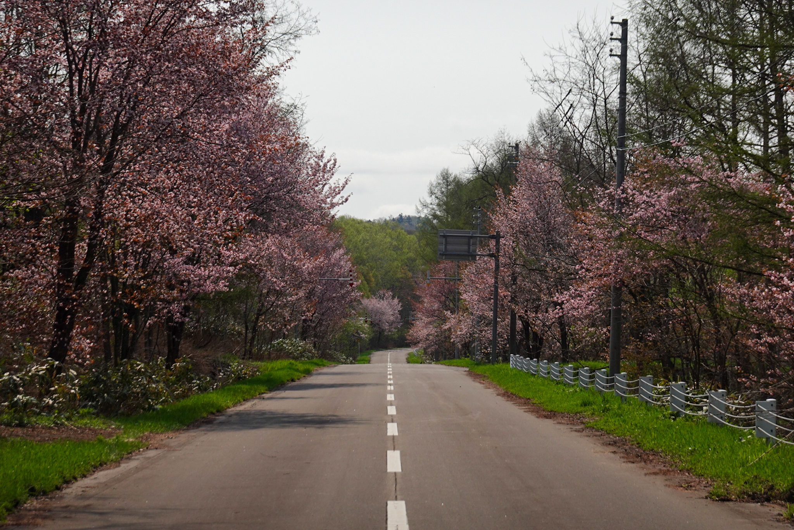
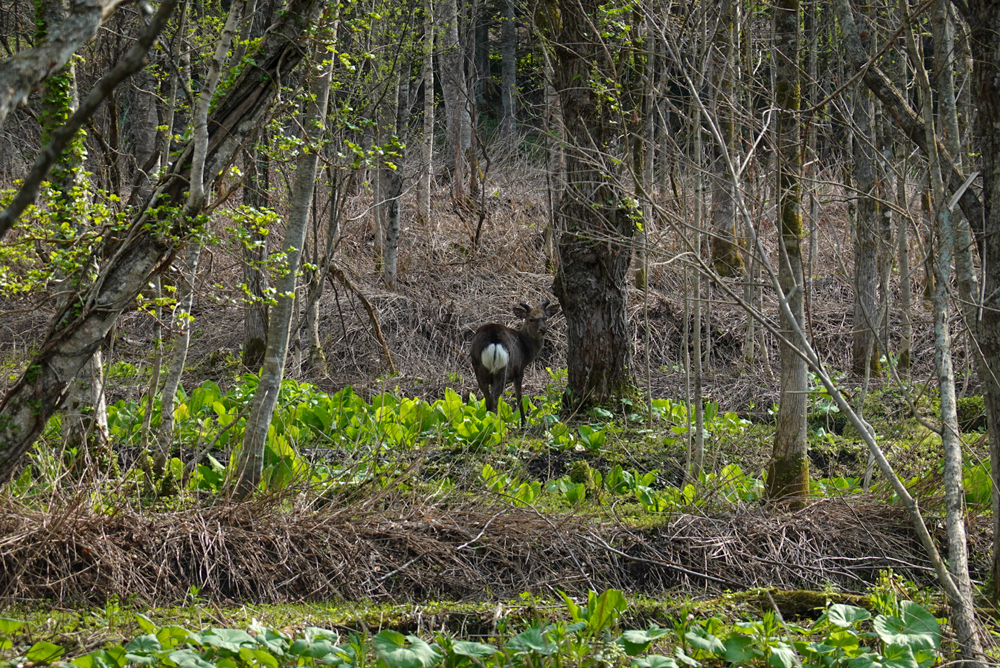

Bei diesem Eintrag bin ich ungefähr drei Wochen in Hokkaido. Auch wenn Hokkaido bekannt ist für die Braunbären, habe ich bis jetzt noch keinen, einzigen entdeckt. Wo die wohl sind?

Auch egal, eigentlich auch gut, denn sonst müsste ich mein Essen noch verstecken und ich hab kein Seil zum Aufhängen der Taschen.

Anstatt Bären gab es dafür haufenweise Rehe. Bei den Nationalpärken sind die meistens gleich neb der Strasse gestanden und nur so auf LKWs gewartet, als hätten die Tiere gerade Exit erfunden. Immer wieder wurde ich von denen erschreckt, weil die genau so leise unterwegs sind, wie ab und zu ich (wenn ich nicht keuchen musste) oder die alten Japanern, welche dann Bären erschrecken und drauf gehen. Aber, lieber ein Reh Schreck als Bärenklaue im Gesicht.

## Die gefahrene Strecke

{{ leaflet() }}

- **Statistik**: $3861\text{m}$ Höhe à $457.36\text{km}$ auf 6 Tage verteilt (via gpx Datei ausgelesen)
- **Stimmung**: Wunder Popo oder kommt das Radler-Leder? Sonst tiptop und glücklich nach dem warmen Wetter!
- **Tote Tiere**: total 24 tote Tiere auf der Strasse oder in der Nähe entdeckt (davon 3 Muscheln, 1 Seehund, 2 Seeigel und 3 asiatische Hornissen)

## Schau! Bin ganz im Norden!

Vielleicht kannst du, der/die/das das hier liest, dich noch daran erinnern, wie ich einst schrieb, dass das Erreichen von den weitesten Orten in jegliche Himmelsrichtungen eher mehr mit einer Abhackliste zu tun hat, als einer kulturellen Wichtigkeit für den Reisenden. Tja, ich war jetzt doch am nördlichsten Punkt Japans, dem Cape Soya! Hat sichs gelohnt? Ja, irgendwie schon... hatte sogar eine schöne Aussicht und Souvenirshops! Auch wurde ich zugejubelt von ein zwei Japanern. Wenn die wüssten, dass ich nicht in einem Tag von Narita nach Cape Soya gefahren bin...





 Das Coole daran, am nördlichsten Punkt zu sein, ist, dass es nur noch Richtung Süden geht und ich somit in die Wärme fahre! Bereits beim Schreiben dieses Berichtes kann ich endlich mit kurzen Hosen draussen sein.
 

Nun, nebst dieser Errungenschaft gehts Richtung Süden wieder nach Honshu mit einem Abzweiger nach Obihiro, welche mir von Tatso-san aus dem einen Rider House empfohlen wurde. Obihiro ist ein ruhiges und müdes Städtchen, ausser sie haben ein Pferderennen.

Um nach Obihiro zu kommen, musste/wollte ich über den höchsten Pass Hokkaidos fahren: dem *Mikuni Pass* mit 1139m Höhe. Und um zum Passstart zu kommen, ging die Route nach dem kurzen Küstenbesuch im Norden wieder Inland über Bifuka.





Während dem Passfahren wurde ich wieder von Japans meistgeliebten Konstrukt begrüsst: dem Tunnel und eher mehrere davon. Beim Mikuni Pass fuhr ich den bis jetzt längsten Tunnel mit ungefähr $3.4\text{km}$ Länge. Es hatte zwar einen engen Gehweg, aber trotzdem wurde mein Trommelfell vom Lastwagen-Lärm gekitzelt. Aber das Tunnelfahren ist bei mir nichts mehr Neues, ich bin abgehärtet auf die!





Trotz des Tunnelfahren ist die Aussicht entlang des Mikuni Passes sehr schön, da die Strasse durch den Daisetsuzan National Parks hindurchführt. Wälder wie das Auge reicht und verschneite Berge, unter anderem der höchste Berg Hokkaidos *Asahi-Dake* (2291m ;Ainu-isch: Kamui-mintara). Interessant ist der starke Wechsel der Landschaft auf beiden Seiten des Passhöhen-Tunnels! 









## Mikuni <s>Passhöhe</s> Passtunnel

Japaner lieben Tunnels oder ich habe wenigstens das Gefühl. Denn beim Mikuni Pass gibt es keine Passhöhe wie in der Schweiz, wo der Himmel auf den Kopf fällt, sondern ein Tunnel.





Gut macht ja auch irgendwie Sinn, denn auf den Berggeraden hat es schlicht zu wenig Platz für einen Passhöhen-Platz und anstatt die Erde abzutragen, baut man lieber einen Tunnel.

Aber die Tunnels in Japan sind für Velofahrer und Motorradfahrer einfach nicht so geeignet und anmachend. Besonders auf den "Liefer"-Strassen, wo die Lastwagen durchfahren, sind diese Krachmacher extrem nervend in Tunnels und schmerzen den Ohren. Aber, man kann es kaum glauben, geben die LKWs genügend Platz beim Überholen. Vielleicht muss man einfach den Kompromiss eingehen.

## Mochi & Daifuku

Bevor es weiter geht mit der Reise, ein ganz kurzer Themenwechsel: Mochis & Daifukus!

Schon gewusst, Mochi ist eigentlich gar nicht das Dessert selbst, sondern der Reisteig um die Füllung herum. Und die Dinger, wenn sie süss schmecken, heissen *Daifuku* und bedeuten "Grosses Glück". Früher gabs die nur zum Neujahr, da die Herstellung sehr aufwendig ist:

{{ youtube(id="tmSrULDVRPc") }}

Aber mit stetiger Weiterentwicklung und Verbesserung des Herstellungsverfahren, sind Daifukus heutzutage jederzeit erhältlich.

Meine erste Mochi und Daifuku Bekanntschaft war im Michinoeki *Mochigome-no-sato Nayoro* (道の駅 もち米の里なよろ; Mochi Reis Dorf Nayoro). Es hatte sehr viele Daifukus zur Auswahl: mit Erdbeeren, Melonen, rote Bohnenpaste und eine Menge weitere. Auch war zum Zeitpunkt Muttertag und die Plastikverpackungen, wo man die Daifukus reinlegte, hatten einen Muttertags-Kleber drauf. "Leider" war meine Mutter nicht hier und musste "leider" die sechs gekauften Daifukus selber essen.









## Im Onsendorf Nukabiragensenkyon

Ziemlich langer Name für ein Onsendorf, aber das Dorf hatte es in sich oder wenigstens das Hotel, wo ich übernachtete. Nach dem Mikuni Pass fährt man irgendeinmal durch dieses Onsen-Dorf. Jedes Hotel hat eine Badhaus, welches auch von Auswärtigen besucht werden darf. Da ich von Tatso-san das Onsenhotel *Nukabira Onsen Nakamuraya* empfohlen wurde, traf ich die Entscheidung, dieses zu besuchen.





Als ich eintrat, wurde es mir direkt gemütlich. Die Eingangshalle war geschmückt mit Haufenweisen Bücherregalen und neben jedem Regal gab es jeweils eine kleine Lounge mit älteren Sesseln. Jede Lounge hatte einen kleinen, offenen Ofen, wo ein Tee aufgesetzt wurde. Der Tee ist gratis für jede\*n, teilte mir einer der Mitarbeiter des Hotels mit, aber der Kaffee kostet! 













Es gab drei Bäder: zwei davon wechseln täglich die Geschlechter und das dritte Bad ist ein gemischtes Aussenbad. Ich war noch nie in einem gemischten Bad und war zu Beginn auch ein bisschen verwirrt. Wie verhält man sich da? Braucht man ein weiteres Tuch für im Wasser? Ich war überfordert. Ich zog Unterhose, Hose und T-Shirt an und höselte zur Rezeption um zu fragen. Die Frage "Do I take the hand towel with me into the water?" wurde mit einem **NO** in Forme von verkreuzten Armen beantwortet. "*No towel, no trousers, no underwear, only naked!*" kam direkt danach (also das Handtuch wird einfach zum Verdecken gebraucht), ich bedankte mich und höselte zurück ins Aussenbad. Das Aussenbad war leer und ich genoss die Aussicht.





Nach dem Onsenaufenthalt entschied ich mich gleich, die Nacht im Hotel zu verbringen, denn es war so gemütlich und skurril. Aber es war auch eine teure Nacht, welche sich doch irgendwie lohnte.

















## Pause in Obihiro

In Obihiro übernachtete ich im Hotel Nupka in einem Hostel-Zimmer. Beim hineinfahren in die Stadt, merkte ich wie ruhig die Stadt ist nebst dem Verkehrslärm. Es war nicht viel los und es gab auch keinen Stress.









Sobald ich im Hotel ankam, merkte ich wie sehr ich den Schlaf brauchte. Ich kollabierte auf dem Bett und war glaube sogar ein bisschen krank vom frischen Wetter. Aber ich konnte mich gut erholen und war nach dem Aufenthalt fitter als vorher. Nun, theoretisch müsste ich mich viel, viel länger erholen, damit mein Körper wieder auf Hochtouren ist, aber ich hab begrenzt Zeit und möchte auch Japan entdecken.





Abends ist meistens mehr los als am Tag. Die arbeitenden Japanern gehen in Izakayas (japanische Bars) um zu trinken, plaudern und den Arbeitsstress loszuwerden. Ich schlenderte durch die Strassen und suchte mir ein passendes Restaurant. Das Coole an der Stadt sind die ab und zu engeren Strassen, welche gefüllt sind mit Restaurants und Bars.









Sonst gab es noch ein bisschen Sightseeing. Ziel war es schon, ja nicht zu viel zu machen, aber auch nicht nichts zu machen. Ich besuchte das Kunstmuseum von Obihiro und den Park, worin sich das Museum befindet. Gefühlt war mehr los auf dem Park als in der Stadt, gut es hatten auch Schulklassen ihren Sporttag, aber der Park war gemütlich.

















## Zeitgefühl und die Flexibilität des Alleinreisens

Achtung, ich habe eine Leserkritik erhalten! Und die ist sogar gut begründet, denn es fehlt ein bisschen an positiven persönlichen Erlebnissen! Aber zuerst etwas, dass ich in dieser Etappe gemerkt habe: das Zeitgefühl.

Je länger man auf Reisen ist, desto kürzer werden die Tage. Nicht mehr bin ich nur einen Monat unterwegs, sondern zum ersten Mal drei und widersprüchlich fühlt es sich jetzt an, als hätte man die Reise erst begonnen. Man merkt sich aber Noch die Highlights und Ups & Downs. Sobald man an die Tage dazwischen denkt, breitet sich die Zeit aus und man bemerkt dann doch die gesamte Reisezeit. Ich hab mal gelesen, dass wir Menschen sehr schlecht sind, grosse Zahlen exakt vorzustellen (z.B. 10000 Äpfel), vielleicht kann dies auch aufs Zeitgefühl angewendet werden?

Nun zur Flexibilität des Alleinreisens. Das Tolle am Alleinreisen ist, dass man die Route selber wählen kann und man sichjederzeit kurzfristige Änderungen erlauben. Gibt es mal einen Tag, wo man nicht wirklich fit ist, kann man eine kürzere Distanz fahren. Man muss sich nicht auf ein Tempo einigen, sondern fährt einfach sein eigenes.

Zwar hat man mit der Einsamkeits-Hürde zu tun, aber man kommt meiner Meinung nach schneller zu einem kurzen Gespräch mit den Einwohnern, egal ob die Sprachbarriere existiert. Mir passiert das fast täglich, besonders auf Campingplätze, dass ich doch noch regelmässig von den Japanern angesprochen werde. Viele werden neugierig, da ich mein Velo mit Taschen und Gurten beschmückt habe. Wie vorher erwähnt, sind dann die Gespräche meist kurz, aber es macht trotzdem Spass und Freude.

Mit der Flexibilität kann man selber entscheiden, was man machen möchte. Zum Beispiel gehts für die nächste Etappe zu zwei Ainu Museen, um etwas über die Ureinwohner Hokkaidos (ehemalig *Ezo*) zu lernen. Auch werde ich die Hokkaido Tour ein bisschen kürzer halten, als gedacht, weil ich noch Süd-Honshu anschauen möchte.

## Sonstige Highlights

Sapperlot, da gibts noch mehr?!?!

































---
Mal positive Selbstreflexionen zu schreiben, scheint doch auch einen positiven Effekt zu haben! Ich werde dies in weiteren Einträge einbauen :)

Eigentlich wollte ich den Post am 15.05. fertigschreiben, aber das Reisen kam dazwischen.




