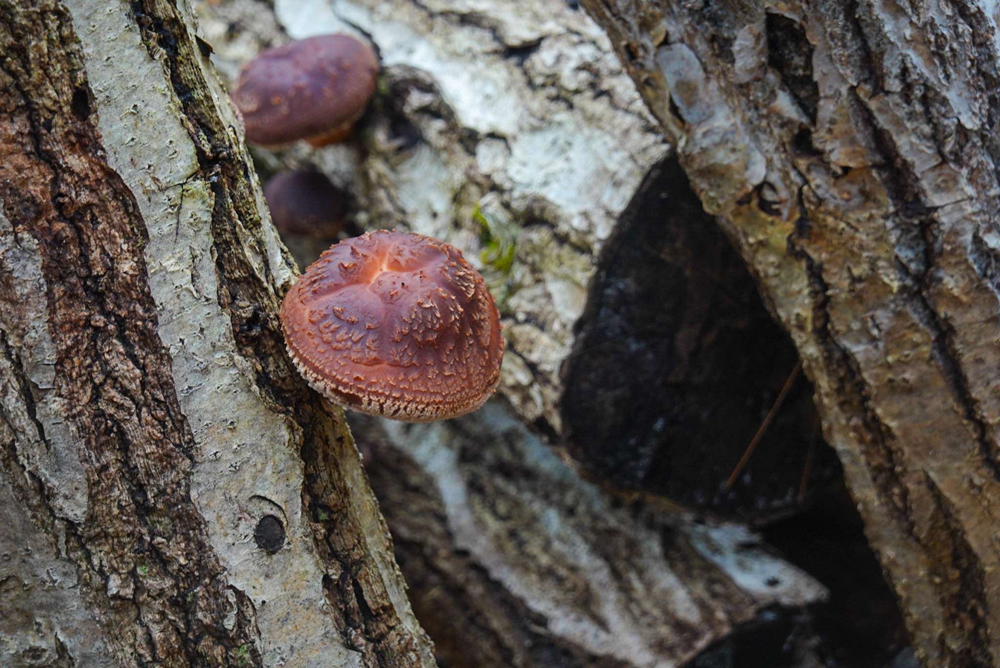

Ganz schön kalt im Frühling, huh? Das Wetter hat mich doch noch überrascht,  bzw. hatte nicht das genügende Kleiderschichten-Sortiment und musste daher ein bisschen investieren. Wahrschnlich wirds noch mehr brauchen...

Nebst wird noch die Titel der Einträge angepasst von _Woche X_ zu _Eintrag X_, da ich nicht regelmässig all 7 Tage einen Eintrag rausbringen kann. Aber nun zu den Gedanken und Highlights der letzten Tagen, geschrieben an einem Samstagabend in einem Gästehaus in Aomori City.
## Die gefahrene Strecke

{{ leaflet() }}

**Statistik**: $6994\text{m}$ Höhe à $506.17\text{km}$ auf 6 Tage verteilt 
**Stimmung**: abnehmend, weil ich wahrscheinlich viel fahre, aber nicht viel sehe.

## Nissage in Onigawa & Ishinomaki

Während dem Pausentag in Ishinomaki ging ich ein bisschen Sachen anschauen, in Obwalden auch hoffentlich bekannt als "eine *Nissage* machen" (Nomen von *nissä*, bedeutet etwas neugierig erkunden).

Was kann man den so anschauen in Ishinomaki? Da gibts einerseits die Katzeninsel *Tashirojima*, wo viele Streuner Katzen auf einer Insel leben. Leider wusste ich von der Insel erst um etwa 09:15, die Fähre zur Insel fuhr um 09:00 ab. Es gab zwar eine um 12:00, aber man hätte dann nur 2 Stunden Zeit die Insel anzuschauen.

Sonst gibts noch das *Ishinomaki Manga Museum*, wo die Werke von Shotaro Ishinomori, dem *König von Mangas*, ausgestellt wurde. Die hab ich besucht!

Ich kenne den Autor zwar nicht und habe keine seiner Werke gelesen, aber er gilt als einer der einflussreichsten Künstler von Japan und hat sogar einen Weltrekord mit den meist veröffentlichten Werken (im gesamten über 128'000 Seiten!). Er und *Gott von Mangas* Osamu Tezuka wandelten die Mangas als witzige und schusselige Comics/Cartoons zu Werken um, welche sich mit ernsteren Themen befassen (Disaster, Tod, Politik, Gesellschaft, etc.), oder schlicht stellten Mangas in ein anderes Licht.













Auch die Strasse vom Bahnhof bis Museum ist geschmückt mit verschiedenen Charakteren von Shotaros Werken!





**Fun Fact**: das *Futaba Inn*, in welchem ich übernachtet habe, ist mit Werken von Shotaro dekoriert und angeblich sei er ein regelmässiger Gast dieses Inns gewesen!





Ishinomaki ist ein kleine Stadt, welches sich mit Shotaro beschäftigt und nebenbei im Fisch-Business tätig ist. Ein interessanter Nachbar von Ishinomaki ist *Onagawa*. Dieses kleine Hafenstädtchen wurde stark von der 2011 Tsunami (& Erdbeben) getroffen und wurde fast komplett zerstörte. Heute wurde der Ort langsam neu aufgebaut und erhielt eine neue Identität. 

Wie kommt man aber nach Onagawa? Mit dem Zug! Das war das erste Mal, dass ich mit dem Zug in Japan irgendwo hingefahren bin und es war eine Zugfahrt. Am Automaten beim Ishinomaki Bahnhof kaufte man sich ein Ticket und liess es von der Prüfmaschine gleich lochen. Der Zug kam sehr früh an, fast 15min vor der Abfahrtszeit (Ishinomaki ist eine Zwischenhaltestelle, daher war dies überraschend). Nach der Abfahrt, klapperte der Zug bei jedem neuen Schienensegment-Übergang und ich schaute mich im Zug um (positionsfixierte Nissage). Viele Japaner hielten ihre Tasche vor sich auf den Schoss als Kissen und schliefen! Was in der Schweiz weniger zu sehen ist, kommt mir fast als Standard in Japan vor. Ob das sicher ist oder nicht, denke ich Kommt auf die Region darauf an.





Onagawa versucht wieder aufzublühen und ist eigentlich auch erfolgreich. Den Ort habe ich von der SRF Doku [Fokus Japan](https://www.srf.ch/play/tv/sendung/fokus-japan?id=9518b1cc-9edf-4939-b3ec-8e48f0fd7811) gehört und wollte Onagawa selbst erkunden!

Direkt vor dem Bahnhof wird von einem Ticketkontrolleur das gelochte Ticket abgenommen und man spaziert in Onagawa ein. Direkt vor dem Bahnhof nebst irgendeiner grossen Shoppingstrasse gab es ein Fussbad! Eigentlich ist der Bahnhof selbst ein Onsen, hab es leider nicht besucht (nicht so getraut).





Das grosse Highlight von Onagawa ist die Shoppingstrasse. Von Kachelteil-Bemalen bis hin zu lokaler Brau-Degustation kann Onagawa für all ein bisschen etwas präsentieren!







.jpg)


## An der Ostküste

Nach dem Pausentag in Ishinomaki ging die Tour weiter. Dazu ging es zuerst Inland an der Route 45 entlang nach Minami-Sanriku, wo die Mittagspause gemacht wurde. Dort war wieder eine Raststätte (Michi-no-eki, nicht vergessen, kommt am nächsten Test dran) und dient auch als Zwischenstation für die Michinoku Coastal Trail Wanderer.





Der Michinoku Coastal Trail ist ein segmentierter Wanderweg, welcher in Hachinoe startet und in Soma endet. Beim Entlangfahren des Weges hatte ich mir erhofft, dass ich mich mit ein paar Wanderer austauschen könnte. Mit halbwegs Erfolg, konnte ich mich ganz kurz mit einem Spanier (glaube ich) austauschen, bevor dieser wieder losflitzte.

Tja, man muss auch alleine auskommen können, was aber immer noch hier und dort Mühe bereitet.





Nach dem Mittagessen endete der Tag in Kesennume, wo ich einerseits haufenweise Fischerboote sah und die erste Kirche! Ich schlief auf einem Campingplatz von einem Hotel und wurde morgens von einem kleinen Ungetier geweckt: eine Schnudernasen-Katze. Ich selbst war auch verkältet, vielleicht war die Katze mein Zwillingsgeschwister!





Die Reise an der Ostküste war immer wieder ähnlich. Man fuhr durch Tunnel, wurde von entweder kleinen Fischerdörfchen oder Grossindustrie begrüsst und man verschwand wieder in einem anderen Tunnel. Die Landschaft war sehr schön und man konnte noch eindrückliche Überbleibsel des Tsunamis entdecken, aber mit der Zeit wurde es auch ein bisschen langweilig.





## Inland oder Ostküste

In Miyako übernachtete ich im *Guesthouse 3710*, nachdem der Besitzer das am Wochenende geschlossene Hostel für mich aufmachte (ich war überglücklich und dankbar). Der nächste Tag präsentierte aber grossen Regenschauer und ich "musste" eine weitere Nacht im Hostel verbringen.









Im Hostel hatte ich es eigentlich satt, weiter an der Ostküste zu fahren. Immer wieder windete es mir gegen Fahrtrichtung, war dadurch auch kalt und es machte mich gefühlt schrittweise kaputt. Als ich aber nach dem Wetter vom Inland schaute, war die Ostküste plötzlich die angenehmere Route. Auch war ich ein bisschen gefangen in der Iwate Präfektur, denn der grösste Teil der Präfektur lebte entweder im Westen im Inland oder an der Ostküste. Dazwischen gab es nur Wald und lange Strassen.

Und daher fuhr ich weiter bis nach Kuji, wo ich dann Richtung Inland fuhr nach Aomori.

## In die Apfel-Stadt über einen Pass

Nach Kuji gings nach Gonohe, wo ich seit langem wieder einen Campingplatz hatte. Zwar musste ich zwei mal quer durch Gonohe radeln, weil ich im falschen Büro nach einer Camping-Bewilligung gefragt habe, aber dafür kostete es nur 210 Yen (ungefähr Fr. 1.25).





Nach einer gemütlichen Nacht, ging es in die Berge und nämlich über den *Kasamatsu* Pass ($1040\text{m}$). Da ich diesen Pass im Frühling anging, war die Strecke sehr cool und auch cool. Der Pass fing in Oirase an und man wurde bei steigendenden Höhenmeter einer stetig höheren Schneewand begrüsst (bis zu etwa 6m hoch). Gegen den höchsten Punkt kam noch der Wind dazu. 





Dafür wurde ich nach langem von Autofahrern bejubelt, nebst einem  Amerikaner gab es auch Japaner, welche  jeweils zwei grosse Daumen-Hoch zeigten. Das munterte mich auf und ich fing auch die Absurdität des Passfahrens ein bisschen zu geniessen.





Da die Strasse mit der Schneewand einen Kanal bildete, zog ein sehr kalter Wind durch. Ich fror mir das Arsch ab und musste schnellsten irgendwo aufwärmen. Ich wusste bereits, wo ich das *irgendwo* finde: das Sukayu Onsen. Dieses Badhaus war ein paar Kilometer nach der Passhöhe aufzufinden. Ich ging rein, genoss das Bad und fuhr Richtung Aomori City, die Apfel-Stadt.





## Äpfel & Nebuta

Die Aomori Präfektur ist bekannt für mindestens zwei Dingen: Nebuta und Äpfel. Es wäre eine Untertreibung, dass Äpfel eine grosse Rolle spielt in der Region. X hunderte Varianten Apfel gibt es und die werden als X verschiedene Produkte verkauft. In *Aomori City*, wo ich jetzt meine Pausentage verbracht hatte, gibt es die *A-Factory*. Dieser Laden verkauft hauptsächlich Apfel-Produkte. Apfel-Schnaps, Apfel-Ringe/-Chips, Apfel-Kartenhalter, Apfel-Kekse, Äpfel für fast 3 Franken pro Stück, Apfel-Kleider und so weiter. Man könnte, glaube ich, den gesamten Haushalt darin kaufen.

### Nebuta Festival

*Nebuta* kommt wahrscheinlich von *Nemuri*, was Schlaf bedeutet (das brauch ich gleich). Nebuta aber ist das Gegenteil. Mit Grossen aus Draht, Lampen und Papier gebastelten Riesenlaternen, welche eine Szene darstellt inspieriert von *Kabuki* (traditionelles japanische Männer-Theaterspiel) wird getanzt und gefestet wie an der Fasnacht in der Schweiz, einfach im Sommer. Diese Laternen werden von einer Menschentruppe durch eine Strasse gestossen und gedreht, währenddessen Tänzer in Festival-Gewänder die Sommerhitze (und Müdigkeit) hinforttanzen/verscheuchen.









## Mentale Hürden

Mit diesen Beiträgen möchte ich auch ein bisschen meine Gedanken während der Reise 'preisgeben'. Bei Solo-Veloreise hat man Zeit zum Nachdenken, meist aber wird dieses Nachdenken durch das Körpergefühl und Ängste verfärbt. Zwar gehts meinem Körper gut, aber aktuell treiben mich Ängste ein bisschen in die Knie.

Diese Ängste sind Einsamkeit und Wildcamping.

Das Letztere ist dumm gesagt einfach lösbar: Platz am Abend suchen, der mir passt (aber nicht perfekt sein muss) und *stealth camping* machen (am Abend Zelt aufstellen und morgen früh wieder abbauen, ohne gross bemerkt zu werden) unter Einhaltung des [Leave No Trace](https://bikepacking.com/plog/seven-principles-for-bikepackers/) Prinzips. Wenn ich morgen noch aufwachen kann, dann verlief es problemlos. Die Angst hat aber eher mit der Fauna zu tun. In Hokkaido gibts Bären, welche ich nicht unbedingt kennenlernen möchte. Die sind zwar nicht so gross wie ein Grizzly, aber sind halt immer noch Bären!

Das Erstere aber, also die Einsamkeit, bereitet mir schon ein bisschen mehr Mühe. Natürlich ist es normal, dass man bei Solo-Reisen mit diesem Problem zu tun hat und doch ist es schwierig, es einfach zu akzeptieren. Ich rede mir bei diesen Reisen immer wieder ein, dass ich auf Leute zugehen kann und meinen sozialen Austauschsdrang stillen kann. Doch in Japan ist es schwierig. Sie sind eher zurückhaltend und daher gehen sie auch nicht direkt auf einen zu. Dazu kommt auch die Sprachbarriere. Telefonanrufe mit Familie hilft sehr, aber ich muss auch lernen, in der Einsamkeit eine gewissen Zufriedenheit zu finden (für die Fälle, wo ein Anruf nicht möglich ist). Dies ist mehr auf der Ebene "Alleine unterwegs sein" zu betrachten und ich schätze den Kontakt mit Freunden, Kollegen und Familie sehr.

Würde gerne mehr dazu schreiben, wird vielleicht auf nächste Woche geschoben.

## Wie weiter und wohin?

Vorerst werde ich weiter nach Hokkaido fahren und schauen wie die Temperaturen werden. Es wird frisch sein, aber ich hoffe dass es sich gut aufwärmt mit der Zeit, die ich in Hokkaido verbinge. Falls es doch noch zu frisch sein wird, werden allenfalls ein Innenschlafsack und warme Kleider gekauft.

Es kommen auch die Fragen, lohnt es sich überhaupt an den östlichsten oder nördlichsten Punkt von Hokkaido zu fahren, da es ja lediglich einen *Checkliste-Abhack*-Ort ist. Vielleicht gibts im Inland auch Interessantes! Aber ich hab mich auch noch nicht so gross befasst, was es überhaupt in Hokkaido zu sehen gibt.

Aber zuerst mal nach Oma und dann schauen wie weiter!

## Sonstige Highlights

So, wie vorher gibts ein paar Highlights ohne grossen Paragraphen!




















































