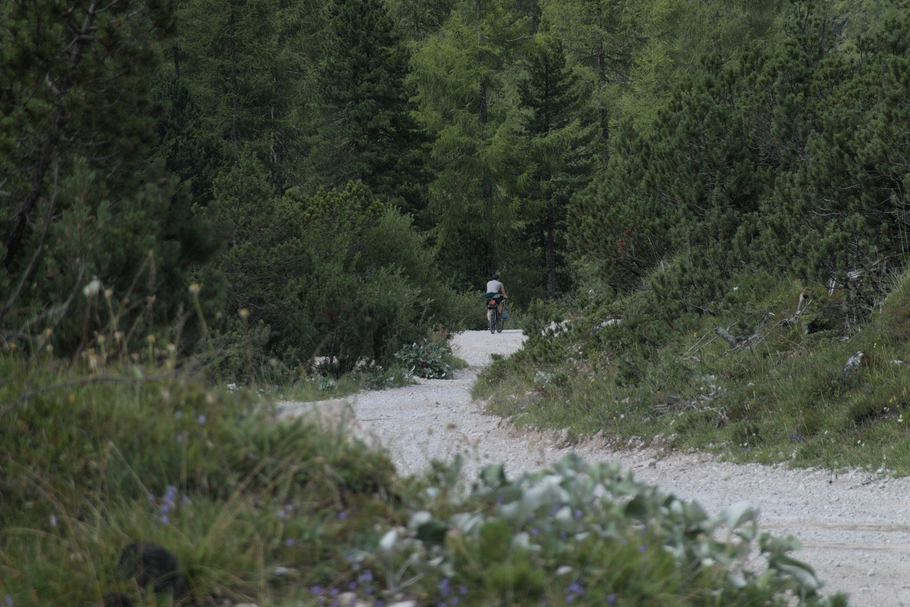



Bevor der eigentliche Text kommt, möchte ich mich bei [Veloplus](https://www.veloplus.ch/) bedanken für das Sponsoring dieser Tour. Ich hatte zuvor bei meiner [_Suisse de Tour_](https://blog.veloplus.ch/2022/01/31/suisse-de-tour-eine-reise-durch-die-schweiz/) Tour sie als Sponsor gehabt und war sehr zu frieden (und bin immer noch)!



## Warum Japan?

Japan selbst war schon seit ein zwei Jahren ein Reiseziel und schon länger war der Begriff "Japan" im Kopf. Früher als Kind schaute ich gerne Studio Ghibli's Filme wie _Mein Nachbar Totoro_ und _Das Schloss im Himmel_  mit meinem Vater. Und als ich lernte, dass die Filme von Hand gezeichnet wurde, da flog mir schon der Hut vom Kopf vor lautem Staunen!

Eine grosse Faszination, welches ich für Japan habe, ist das Handwerk. Es werden immer noch viele Dinge von Hand gemacht, von Essstäbchen bis hin zu Animationsfilmen, meist über mehrere Generationen hinweg. Aber auch ist eine Veränderung in Japan zu erkennen. Das Land ist alt, wenn man die Altersverteilung anschaut, und die jungen Japaner:innen ziehen in die Grossstädte wie Tokyo oder Osaka, um sich zu verwirklichen, während wahrscheinlich die kleinen Dörfer verlottern. 

Es ist ein Land im Wandel. Diese Dinge, die dich ich irgendwo in Büchern, Dokumentationen und im Internet gelesen und gesehen hatte, fingen an, ein mentales Bild zu malen. Nun möchte ich versuchen, es selber weiter zu malen!

## Aber warum mit dem Velo?

Weil's eine der besten Arten ist, um ein Land kennen zu lernen, nebst dem Backpacking und im Land wohnen. Das heisst aber auch, dass man offen sein muss und sich mit der Kultur des Landes auseinandersetzen muss.

Mit dem Auto reisen verschwindet für mich die Anwesenheit im Hier und Jetzt. Man ist geschützt vom Unwetter und lebt dumm gesagt in einer kleinen Biosphäre, die ab und zu geöffnet wird. Man schaut sich die Reise "hinter einem Fenster" an. Als Velofahrer ist man der Natur ausgesetzt. Wenn es regnet, muss man mit dem Regen klar kommen. Wenn die Sonne scheint, muss man ebenfalls damit umgehen können.





Auch ist das Veloreisen gleichzeitig eine gemütliche und auch ungemütliche Sache. Jeden Tag sitzt man auf dem Velo und kommt nur so weit, wie man selbst mag. Meistens gibt es Tage, an denen die Beine schmerzen, und anderen, wo man mental erschöpft ist. Zum Beispiel, bei mir ist immer der vierte oder fünfte Tag ein Tiefpunkt. Mein Körper und Kopf möchten mit dieser abstrus dummen Idee aufhören. Und doch fahre ich weiter.

Und doch gibt es Tage, an denen man jede Sekunde geniesst. Wo man freudig und neuigierig auf die Einwohner mit Fragen hineinstürzt oder einfach das Wetter geniesst. Wenn es sonnig ist und ein leichter Wind umherweht, das ist totaler Bliss!

Eine tolle Sache an diesen Touren ist der Zwang, flexibel zu bleiben. "Toll" im (positiven) Sinne, dass es mich dazu zwingt. Jeden Tag muss man schauen, wie weit man fahren will, wo man etwas essen möchte, wo man schläft oder wo man ein bisschen länger sein möchte. Diese Flexibilität erleichtert auch das Planen von Touren. Man definiert die zu bereisenden Regionen, den Hin- und Rückflug, vielleicht noch das Hotel zum Jetlag ausnüchtern und der Rest ist das Problem vom Zukunfts-ich!

## Die Planung

Die Planung fing bereits im September/Oktober an. Anstatt im Unterricht an der Hochschule aufzupassen oder an meiner Bachelor-Thesis zu arbeiten, recherchierte ich über Japan. _Wann möchte ich nach Japan?_, _Was möchte ich sehen?_, _Wo gibts diese fancy Toiletten?_ und _Wie kann ich die Japaner nach bestimmten Orten fragen?_ waren Fragen, welche mir durch den Kopf schoss.

Für den Hin- und Rückflug entschied ich mich für einen Direktflug, um die Transport-Logistik einfach zu halten. 

### Werkzeuge

Um die ungefähren Kilometern zu planen, verwende ich [Komoot](https://www.komoot.com/). Diese Tool ist sehr nützlich, denn man kann Strecken-Segmente von anderen Reisenden und Sportarten mit einbeziehen. Ich verwende es mehr um die Streckeninformationen (Länge, Höhenmeter, Streckentypen Aufteilung, etc.) zu ermitteln und Highlights mit einzubeziehen.  

### Testfahrt

Entweder zum Schauen ob alles Platz hat oder ob man eine Nacht durchhält, eine Testfahrt ist immer nützlich zum Schauen ob was fehlt oder was zu viel eingepackt wurde. Nachdem man ein paar Touren gemacht hat, weiss man ungefähr, was man braucht. Und doch ist es nützlich, vor der eigentlichen Abreise, eine eintägige oder mehrtägige Fahrt zu machen.


![[testfahrt-setup.jpg]]


Da mein Setup sich bei jeder Tour ändert, mit der Hoffnung auf _das_ Setup, ist das Packen des Velos sehr nützlich, um zu sehen ob überhaupt alles Platz hat. Bei meiner Testfahrt fuhr ich zu meinen Eltern nach Hause, wo noch den Camping-Kochtopf und mein Reiseadapter waren. Ich merkte jedoch, dass danach die Taschen sehr voll waren. Daher muss ich noch schauen, was ich eventuell nicht brauche oder anders packen kann.