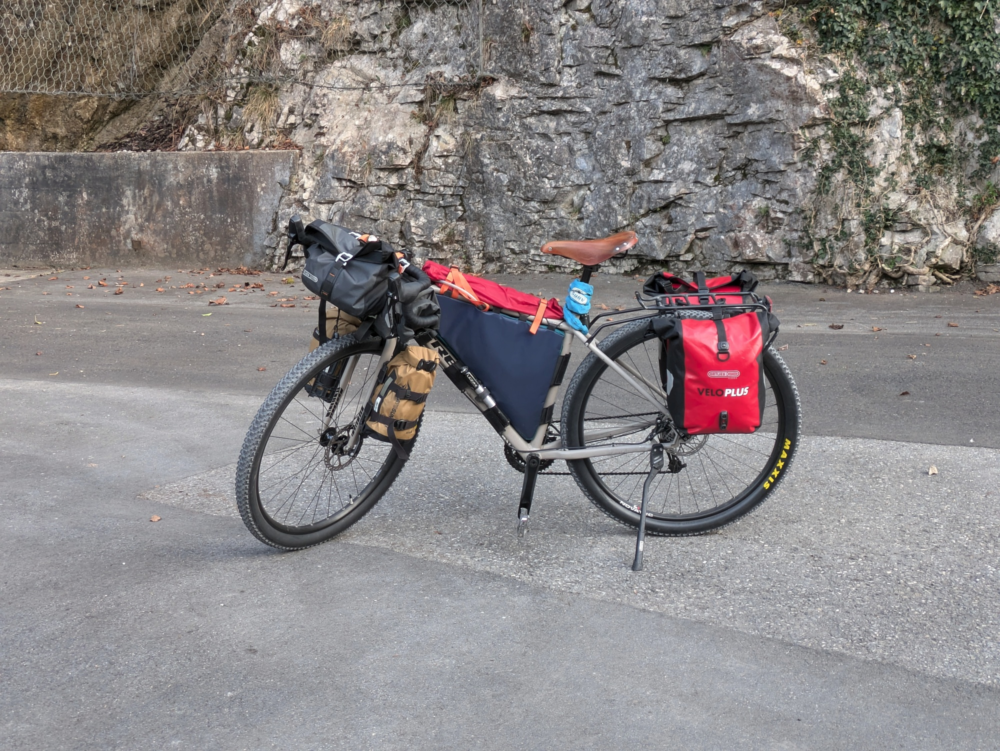



Bevor der eigentliche Text kommt, möchte ich mich bei [Veloplus](https://www.veloplus.ch/) bedanken für das Sponsoring dieser Tour. Ich hatte zuvor bei meiner [_Suisse de Tour_](https://blog.veloplus.ch/2022/01/31/suisse-de-tour-eine-reise-durch-die-schweiz/) Tour sie als Sponsor gehabt und war sehr zufrieden (und bin immer noch)!



## Warum Japan?

Japan selbst war schon seit ein, zwei Jahren ein Reiseziel und schon länger war der Begriff "Japan" im Kopf. Früher als Kind schaute ich gerne Studio Ghibli's Filme wie _Mein Nachbar Totoro_ und _Das Schloss im Himmel_  mit meinem Vater. Und als ich lernte, dass die Filme von Hand gezeichnet wurde, da flog mir schon der Hut vom Kopf vor lautem Staunen!

Eine grosse Faszination, welches ich für Japan habe, ist das Handwerk. Es werden immer noch viele Dinge von Hand gemacht, von Essstäbchen bis hin zu Animationsfilmen, meist über mehrere Generationen hinweg. Aber auch ist eine Veränderung in Japan zu erkennen. Das Land ist alt, wenn man die Altersverteilung anschaut, und die jungen Japaner:innen ziehen in die Grossstädte wie Tokyo oder Osaka, um sich zu verwirklichen, während wahrscheinlich die kleinen Dörfer verlottern. 

Es ist ein Land im Wandel. Diese Dinge, die dich ich irgendwo in Büchern, Dokumentationen und im Internet gelesen und gesehen hatte, fingen an, ein mentales Bild zu malen. Nun möchte ich versuchen, es selber weiter zu malen!

## Aber warum mit dem Velo?

Weil's eine der besten Arten ist, um ein Land kennenzulernen, nebst dem Backpacking und im Land wohnen. Das heisst aber auch, dass man offen sein muss und sich mit der Kultur des Landes auseinandersetzen muss.

Im Vergleich zum Autoreisen (oder wie es die Influencer gerne nennen: _roadtrips_ oder _van life_), ist man mit dem Velo langsam unterwegs. Aus einer einstündigen Strecke wird plötzlich eine fünfstündige. Die Distanzen "verlängern" sich und man ist dem Wetter ausgesetzt. Wenn es regnet, muss man mit dem Regen klarkommen. Wenn die Sonne scheint, muss man auch damit umgehen können. Aber irgendwie hat es für mich auch einen Vorteil: als klatschnasser Tourist komme ich viel leichter mit den Einheimischen ins Gespräch übers Unwetter!





Auch ist das Veloreisen gleichzeitig eine gemütliche und auch trostlose Sache. Jeden Tag sitzt man auf dem Velo und kommt nur so weit, wie man selbst mag. Meistens gibt es Tage, an denen die Beine schmerzen, und anderen, wo man mental erschöpft ist. Zum Beispiel, bei mir ist immer der vierte oder fünfte Tag ein Tiefpunkt. Mein Körper und Kopf möchten mit dieser abstrus dummen Idee namens "Velotour" aufhören. Trotzdem fahre ich weiter.

Denn es gibt Tage, an denen man jede Sekunde geniesst. Wo man freudig und neugierig auf die Einwohner mit Fragen hineinstürzt oder einfach das Wetter geniesst. Wenn es sonnig ist und ein leichter Wind umher weht, das ist totaler Bliss!

Für mich ist diese Art zum Reisen eine gute Ablenkung vom Alltag. Viel mehr bin ich mit dem Hier und Jetzt beschäftigt, als mit dem, was ich hätte tun können. Weniger Social Media, generell weniger Internet Konsum und man hat auch wieder mal Zeit zum Nachdenken (von der Langeweile während dem Fahren). "Raus gehen und Gras anfassen" könnte man sagen. Dies ist aber keine Provokation gegen betreffende Personen, sondern mehr, wie ich mit mir selber umgehe.

Vielleicht werde ich diese Thematik weiterführen während oder nach der Reise :)

## Die Planung

Ein bisschen was zur Planung. Die fing bereits im September/Oktober 2024 an. Anstatt im Unterricht an der Hochschule aufzupassen oder an meiner Bachelor-Thesis zu arbeiten, recherchierte ich über Japan. _Wann möchte ich nach Japan?_, _Was möchte ich sehen?_, _Wo gibts diese fancy Toiletten?_ und _Wie kann ich die Japaner nach bestimmten Orten fragen?_ waren Fragen, welche mir durch den Kopf schoss. Was genau aber will ich eigentlich in Japan machen?

Mich selbst komplett ins kalte Wasser werfen! Also ausserhalb der Komfortzone sein und was neues erkunden. [TODO]

Für den Hin- und Rückflug entschied ich mich für einen Direktflug, um die Transport-Logistik einfach zu halten. Den Velo-Karton hab ich, aber muss noch schauen, wie ich die einzelnen Tasche beim Check-In abgeben werde. Oder wie ich überhaupt das ganze Zeug zum Flughafen bringen kann... [TODO]

### Software & Webseiten

Folgend sind ein paar Apps und Webseiten, welche ich für die Tour verwenden werde: [TODO]

#### Komoot

Um die ungefähren Kilometern zu planen, verwende ich [Komoot](https://www.komoot.com/). Dieses Tool ist sehr nützlich, denn man kann Strecken-Segmente von anderen Reisenden und Sportarten mit einbeziehen und man erhält eine ungefähre Schätzung der Fahrzeit. Es gibt ein Premium-Abo, um mehrtägige Touren planen zu können, aber das war mir nicht so nützlich, da ich jeden Tag vorweg schaue, wie weit ich komme.

#### Organic Maps

[Organic Maps](https://organicmaps.app/) ist eine schlanke, freie Karten-App mit Offline-Funktionalität. Karten können nach Region heruntergeladen werden und beinhalten sehr viele Informationen. Ich verwende die App grösstenteils um nach Trinkwasser zu suchen oder die Steigung einer Strecke einzuschätzen. Aber auch kann die App offline Routen berechnen für Velo und anderen Fortbewegungsmittel! 

#### myMizu

Während der Japan-Recherche bin ich auf [myMizu](https://www.mymizu.co/home-en) gestossen, welche Wassernachfüllstationen anzeigt. Das wird nun auf dieser Tour ausprobiert!

#### Warmshowers

Zwar nicht so weit verbreitet in Japan, bleibt [Warmshowers](https://www.warmshowers.org/) eine nützliche Seite. Ich bin schon seit einiger Zeit auf dieser Plattform, zwar leider nicht als Host. Auf der Seite können, ähnlich wie Couchsurfer, Leute eine Schlafmöglichkeit anbieten (und eine warme Dusche), aber ist einfach mehr für Velofahrer ausgelegt. Als Bezahlung nimmt man entweder ein paar Zutaten für das Nachtessen mit, ein paar Biere oder einfach die bisher gesammelten Reise-Geschichten.

#### Google Maps

seit einiger Zeit hatte ich zwar eher Mühe mit Google Maps. Sucht man nach Hostels, erhält man Resultate für alles nebst Hostels. Doch hat es seine Vorteile beim Suchen von gewissen Orten oder Shops. Für diese Tour versuche ich mal Google Maps nur wenns sein muss zu verwenden! 

### Testfahrt

Entweder zum Schauen ob alles Platz hat oder ob man eine Nacht durchhält, eine Testfahrt ist immer nützlich zum Schauen ob was fehlt oder was zu viel eingepackt wurde. Nachdem man ein paar Touren gemacht hat, weiss man ungefähr, was man braucht. Und doch ist es nützlich, vor der eigentlichen Abreise, eine eintägige oder mehrtägige Fahrt zu machen.





Da mein Setup sich bei jeder Tour ändert, mit der Hoffnung auf **das** Setup, ist das Packen des Velos sehr nützlich, um zu sehen ob überhaupt alles Platz hat. Bei meiner Testfahrt fuhr ich zu meinen Eltern nach Hause, wo noch den Camping-Kochtopf und mein Reiseadapter waren. Ich merkte jedoch, dass danach die Taschen sehr voll waren. Daher muss ich noch schauen, was ich eventuell nicht brauche oder anders packen kann.
