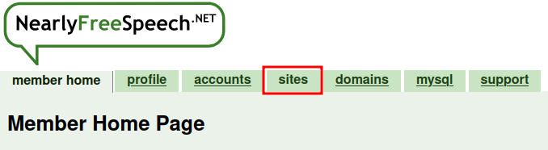
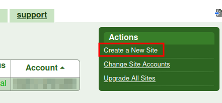
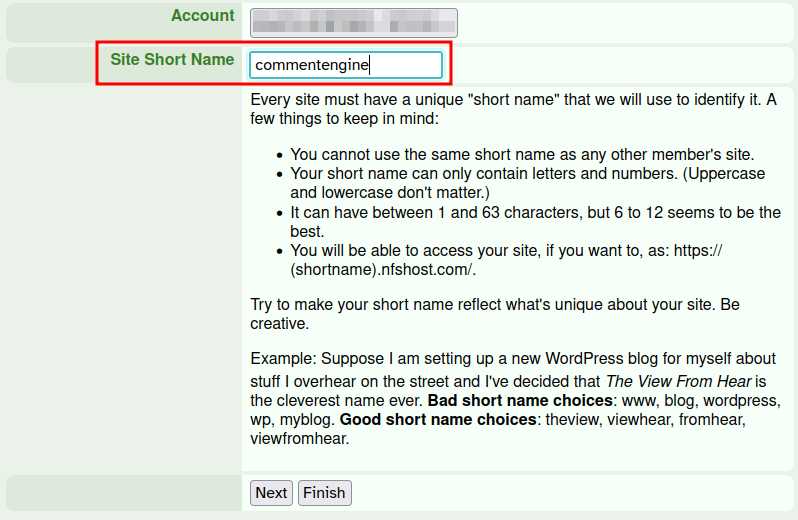
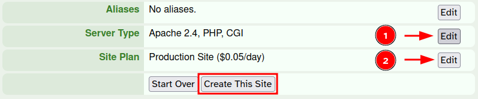



_NearlyFreeSpeech.NET_ will be abbreviated to _NFSN_ from now on!



In this guide, I'll show you...

- ...<a class="internal" href="#how-to-create-and-configure-a-nsfn-site">how to create and configure a NSFN site</a>
- ...<a class="internal" href="#install-remark42-on-the-nsfn-instance">install Remark42 on the NSFN instance</a>
- ...<a class="internal" href="#connect-your-website-with-the-remark42-instance">connect your website with the remark42 instance</a> (I'll be using [Zola](https://www.getzola.org/))
- ...<a class="internal" href="#enable-github-authentication">enable GitHub Authentication</a>

---

It all started with asking my brother about how and where to host a commenting engine. While this blog doesn't have much to offer (yet), since I'm going on a bike tour soon, I've thought to allow my friends to directly comment on my posts :-)

Anyway, my brother suggested Remark42, which seemed very neat and good enough for my page. My requirements for a commenting engine is to not use engines which intentionally misuse other features such as [utterances 🔮](https://github.com/utterance/utterances) or rely on external services such as [Disqus](https://disqus.com/). In other words, I don't care about statistics and want something, which I can customize! This is why Remark42 seems to be a great fit!

## How to Create and Configure a NSFN Site

What I love about NSFN is how it utterly shits on user friendliness. This comes with the advantage of having a really cheap and a pay-as-you-use service. If you've got experience with setting up a daemon on Linux, then this shouldn't be too much of a hastle!

### Create a NSFN Site

1. Go on [https://www.nearlyfreespeech.net/](https://www.nearlyfreespeech.net/) and create an account
2. Create a new site (which might require adding a funds account)
	1. click on the **sites** tab 
	2. click on _Create a New Site_ in the box on the right side 
	3. set short name for site and then click _Finish_ 
	4. click the _Edit_ buttons for both Server Type and Site Plan and configure them as following 
		- **Server Type**: select _Custom_
		- **Site Plan**: select _Non-Production Site_ (the commenting engine is not _that_ important to keep alive)
	5. And finally click _Create This Site_

### Configure a NSFN Site



NSFN does not support Docker (yet or probably never). This limits us to using binaries!



1. Open up the page by clicking again on the _sites_ tab and then clicking the **Shortname** of the page, not the URL
	- The new page shows you all there is to now about the page. Here you can make all the configuration you want.
2. Do <a class="internal" href="#install-remark42-on-the-nsfn-instance">Install Remark42 on the NSFN Instance</a>
3. Now back to the NSFN website, click _Add a Daemon_ in the **Daemons** group
	- **Tag**: set a smart name (for example "commentengine")
	- **Command Line**: `/home/protected/remark42/run.sh` $\rightarrow$ upon creation, NSFN executes the given command
	- **Working Directory**: `/home/protected/remark42/`
	- **Run Daemon As**: `me`
4. After creating a daemon, click _Add a proxy_ in the **Proxies** group
	- **Protocol**: `HTTP`
	- **Base URI**: `/`
	- **Document Root**: `/`
	- **Target Port**: `8080`


## Install Remark42 on the NSFN Instance

1. Once the site is ready, connect to it via SSH
	- Under _SSH/SFTP Information_ the Hostname (Username and URL) is located. Password is the same as for the member-login.
	```bash
	ssh <USER>@<SSH-URL>
	```
2. Create a folder called `remark42` under `/home/protected/` via SSH
	```bash
	mkdir /home/protected/remark42
	```
3. Download the Remark42 binaries for FreeBSD ([https://github.com/umputun/remark42/releases](https://github.com/umputun/remark42/releases))
4. Open another terminal and via `scp` copy the binaries to the site into the created folder (or do it any other way)
	```bash
	scp ./remark42.freebsd-amd64.tar.gz <USER>@<URL>:/home/protected/remark42
	```
5. Unzip the copied file
	```bash
	cd /home/protected/remark42
	tar -xf remark42.freebsd-amd64.tar.gz
	```
6. Create a file called `remark42.env` in the `remark42`-folder
	- This is used to configure the Remark42 instance, such as:
	```nano
	SECRET="topsecret"
	REMARK_URL="https://example.com/"
	SITE="blabla"
	EMOJI=true
	```
7. Create an empty script file called `run.sh` (or any other name) in the `remark42`-folder
	- Insert following content, which loads the `.env` file and starts the server
	```bash
	#!/bin/bash
	set -a # automatically export all variables
	source ./remark42.env 
	set +a

	exec /home/protected/remark42/remark42.freebsd-amd64 server
	```
8. And change permissions
	```bash
	chmod a+x run.sh && chmod a+rw remark42.env
	```
## Connect Your Website With the Remark42 Instance

## Enable Github Authentication
