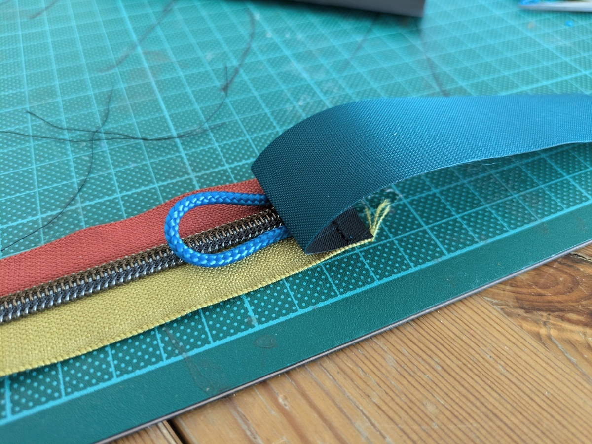

Before getting into too much detail, this guide is heavily based on the original frame bag guide  [DIY: How to Make A Simple Frame Bag](https://bikepacking.com/gear/how-to-make-a-bikepacking-framebag-krampus/). Instead of using Velcro on all of the sides, I instead replaced the top side with laces, like shoe laces!

# List of Materials



- <u>Sewing machine</u> (capable of at least straight stitching ; cool if it also can do _Triple straight stitching_)
- <u>Pair of fabric scissors</u> _or_ a <u>fabric rotary cutter</u>
- <u>Jeans sewing needles</u> (**Recommended**)
- <u>Sewing pins</u> _and/or_ <u>sewing clips</u>
- <u>Cutting board</u>
- <u>Quilt ruler</u> (**Recommended**)
- <u>Measurement tape</u>

---

- <u>A cardboard cutout of the bike frame</u> $\rightarrow$ don't forget include markings of the screws inside and outside of the frame. If you've got a _Trek 920_, this is your lucky day: 
{{ button (text="Download Design Pattern" link="fullframebag_trek920.pdf" type="pdf") }}

All sides have seam allowances of ca. $1\text{cm}$ added!




- <u>Outside fabric</u> $\rightarrow$ Protective layer of the bag, usually something sturdy. I used a nylon fabric with a plasticised layer to have some weather protection.
- <u>Stiffner material</u> $\rightarrow$ used for the side walls to give them shape.
- <u>Inside fabric</u> $\rightarrow$ to hide the stiffener material and make the inside nice to look at.
- <u>Velcro</u>  $\rightarrow$ any type is usable, as long as it's sew-able.
- <u>Nylon based string</u> $\rightarrow$ to lace up the frame bag to the top bar of my bicycle.
- <u>Polyester sewing thread</u>


# Sewing Steps

## Cut Fabric

## Combine Outer and Inner Layer and Stiffener

## Prepare Lace Loops

## Sew Zipper to Sidepanel

## Sew Everything together

