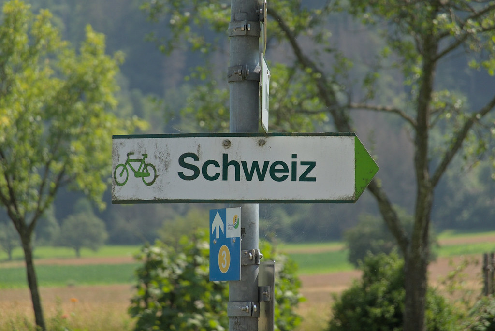

---
# Feel free to add content and custom Front Matter to this file.
# To modify the layout, see https://jekyllrb.com/docs/themes/#overriding-theme-defaults

layout: home
hide_home: true
---

Hi I'm Joel
{: .font-big .bold}

An electrical engineering student.
{: .font-bigger}
\
This website is not very active and I mostly write just when I feel like. The most active page is my projects page, which not only contains my summaries, but also some bike touring reports.

{:.rounded}

### Links

- [Downloads](/downloads){:.obnoxious} &ndash; Here you can find some stuff to download, for now being just my summaries
- [Github](https://github.com/joelvonrotz){:.obnoxious} &ndash; Link to my Github profile
- [Flickr](https://www.flickr.com/joelvonrotz){:.obnoxious} &ndash; As I do some photography here and there, you can find the photos on my flickr profile.
